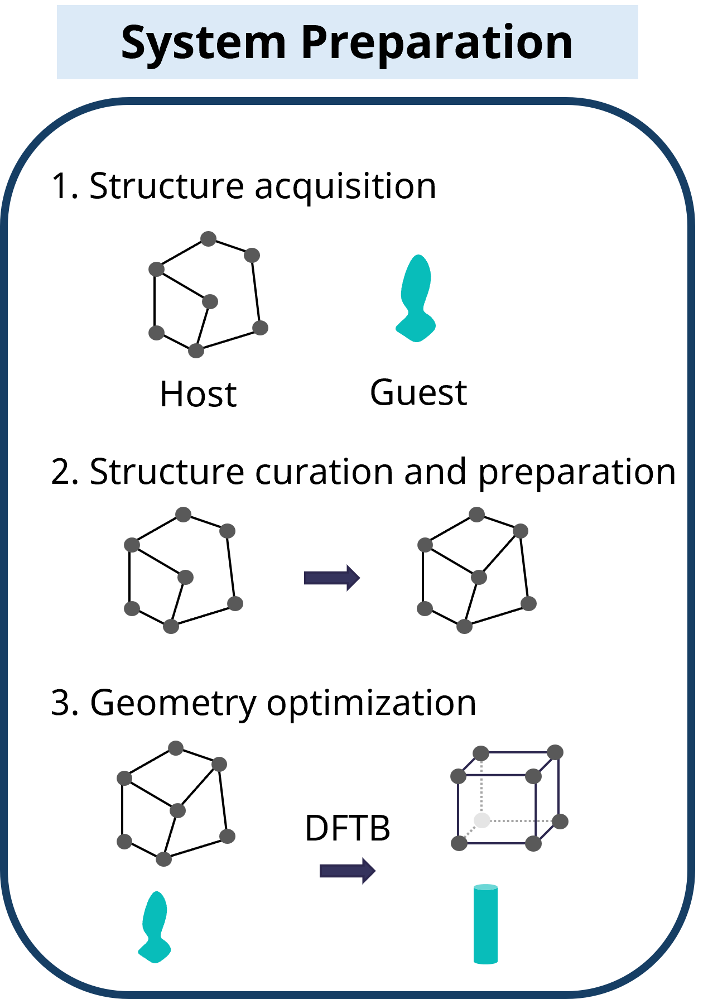
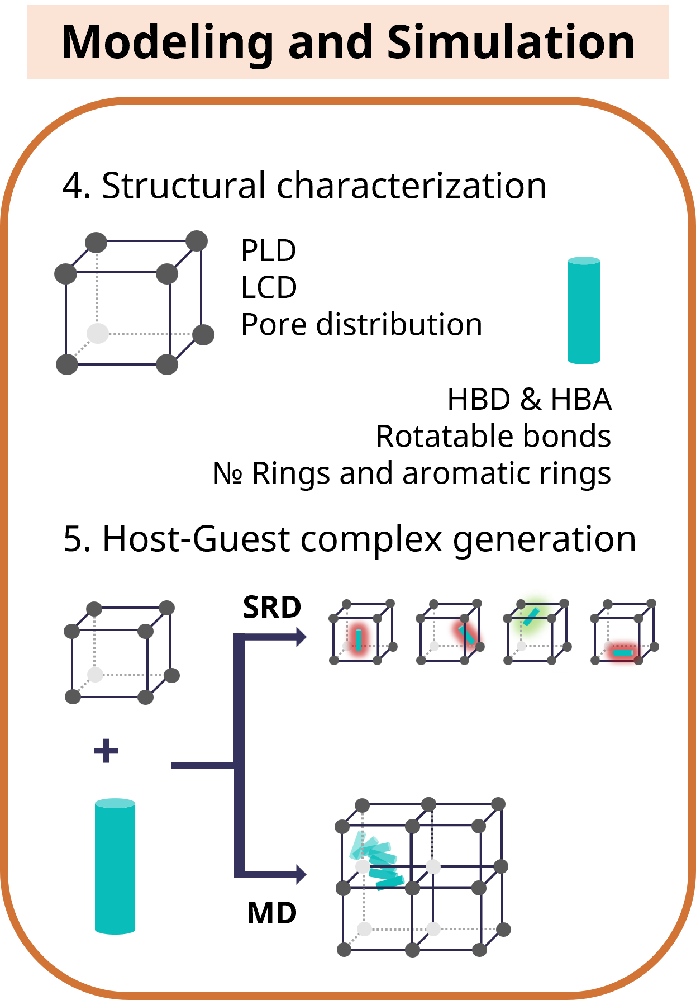
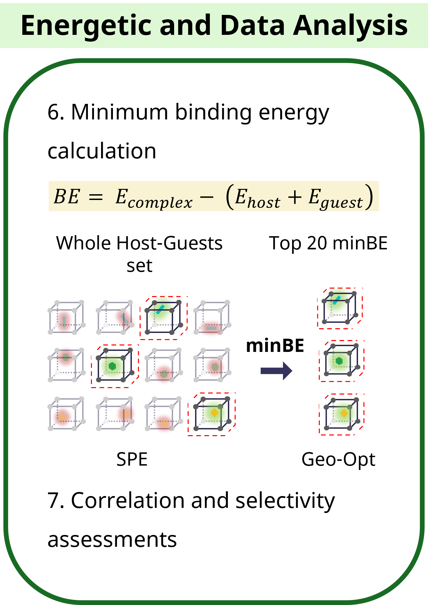

# MSc Chemistry Thesis -- TUD 2025
---
## Impact of Framework Topology on the Selective Separation of Pharmaceuticals and Cannabinoids in Metal-Organic Frameworks
---
**Author:** Adriana Ugarte-La-Torre

**Supervisors:** [Prof. Thomas Heine](http://theory.chm.tu-dresden.de/members.shtml?name=theine), [Dr. Dinga Wonanke](https://www.dingawonanke.com/), [Dr. Jan-Ole Joswig](http://theory.chm.tu-dresden.de/members.shtml?name=jojoswig)

[Chair of Theoretical Chemistry, Technische Universität Dresden](https://tu-dresden.de/mn/chemie/pc/pc1)

---

**Abstract:** This study investigates how framework topology influences the binding of pharmaceutical pollutants and cannabinoids within a family of porphyrinic Zr-MOF polymorphs, MOF-545 (**csq**), NU-902 (**scu**), PCN-223 (**shp**), and PCN-225 (**sqc**), that share identical $Zr_{6}$ and TCPP building blocks, thereby isolating structural effects from compositional ones in contrast to prior studies comparing topologies across frameworks of differing chemical composition. The minimum binding energy, computed as the gas-phase electronic interaction energy difference between the GFN1-xTB-optimized host-guest complex and its isolated constituents at the same level of theory, was used as the primary metric for selectivity assessment across 37 guest molecules (20 pharmaceutical contaminants, 17 cannabinoids). Host-guest configurations were sampled via two complementary strategies, stochastic rigid-body docking (SRD) and classical molecular dynamics (MD), yielding a combined pool of 62,800 configurations per host-guest pair. Single-point energy screening at the GFN1-xTB level was applied to the full configuration pool; top candidates from each method were subsequently geometry-optimized and re-evaluated by single-point energy calculation to obtain the final reported binding energies. Results show that topology preference is guest-specific: no single topology ranks highest across all guests. For the cannabinoid set, PCN-223 (**shp**) shows the least differentiation in binding energy among cannabinoid isomers relative to the other topologies. This work establishes a gas-phase electronic interaction energy baseline for topology-driven selectivity in chemically identical MOF polymorphs; entropic contributions from guest packing and solvation effects remain outside the scope of this study and warrant further investigation.

**Keywords:** Metal-Organic Frameworks, Zr-MOFs, framework topology, porous materials, selective separation, host-guest chemistry, binding energy, pharmaceuticals, cannabinoids, molecular dynamics, computational screening

---

### Objectives

a) Investigate how framework topology governs the selective binding of pharmaceutical contaminants within an isoreticular family of porphyrinic Zr-MOFs sharing identical building blocks\
b) Investigate how framework topology governs the selective binding of cannabinoids within the same MOF family

- Characterize the pore geometry and channel architecture of each framework topology
- Sample host-guest configurations for all MOF-guest combinations via stochastic rigid-body docking (SRD) and classical molecular dynamics (MD)
- Screen the full configuration pool via GFN1-xTB single-point energy calculations to identify low-energy candidates
- Determine the final binding energy of each host-guest pair by GFN1-xTB geometry optimization of top candidates followed by single-point energy re-evaluation
- Compare binding energy profiles across the four topologies to identify topology-driven selectivity trends within each guest library

---

### Methodology

<table>
  <tr>
    <td align="center">
      <a href="system-preparation/system-preparation.md">
        
      </a>
    </td>
    <td align="center">
      <a href="modeling-and-simulation/modeling-and-simulation.md">
        
      </a>
    </td>
    <td align="center">
      <a href="energetic-data-analysis/energetic-data-analysis.md">
        
      </a>
    </td>
  </tr>
</table>
<p align="center"><em><b>Figure 1.</b> Overview of the computational methodology, from structure acquisition and curation through molecular simulation to energetic data analysis.</em></p>

The methodology comprises three sections. The first, covering steps 1–3, prepares the structures prior to analysis. The second, covering steps 4–5, characterizes both host and guest structures and generates the host–guest complexes via the two sampling methods. The third, covering steps 6–7, examines the host–guest complex energetics to compute the binding energy. Figure 1 represents these major sections.

All calculations were performed on the High-Performance Computing facilities at TU Dresden (ZIH). Quantum-level geometry optimizations and single-point energies were carried out with [AMS](https://www.scm.com/amsterdam-modeling-suite/) (GFN1-xTB, D3(BJ)). Guest RESP charges were derived from HF/6-31G(d) wavefunctions computed in [ORCA](https://www.faccts.de/orca/) and processed with [Multiwfn](http://sobereva.com/multiwfn). Molecular dynamics simulations were run in [LAMMPS](https://www.lammps.org/) using the UFF4MOF/EQeq force field for host frameworks and GAFF2/RESP for guest molecules. Force field topology files were prepared with [AmberTools](https://ambermd.org/AmberTools.php). Host framework partial charges were assigned via a C++ implementation of the [Extended Charge Equilibration method (EQeq)](https://pubs.acs.org/doi/10.1021/jz3008485) applied directly to the CIF files. Data analysis pipelines were written in Python.

---

### Computational cost

The scale of the SPE screening step warrants explicit accounting. Each host-guest pair yielded 60,000 SRD configurations (3 independent runs of 20,000 each) and 2,800 MD snapshots (7 independent trajectories of 400 frames each), for a combined pool of **62,800 configurations per pair**. Across all 4 host frameworks and 37 guest molecules (148 pairs), this amounts to **approximately 9.3 million GFN1-xTB single-point energy calculations** for the screening stage alone, not including the geometry optimizations performed during system preparation or the post-screening optimization of selected candidates. All calculations were distributed across the ZIH HPC cluster.

<!--- Placeholder: wall-time statistics, core-hours consumed. --->

---

### Results and conclusions

The full analysis is in [`results/selectivity-assessments-results.md`](./results/selectivity-assessments-results.md)
(binding-energy results and selectivity) and [`results/method-assessments.md`](./results/method-assessments.md)
(sampling and DFTB-screen reliability); the committed numerical results are in
[`thesis/070_CORRELATION/`](./thesis/070_CORRELATION/). The main conclusions:


**Topology preference is guest-specific.** No single framework binds every guest
most strongly. Among the three frameworks whose sampling is methodologically
comparable (shp/scu/sqc), the two tightest pores, **NU-902 (scu)** and
**PCN-225 (sqc)**, together take ~90 % of all first-place rankings and
**PCN-223 (shp)** is rarely best, consistent with a qualitative (not formally
fitted) trend that tighter confinement gives a stronger gas-phase interaction.

**MOF-545 (csq) is excluded from host-strength comparisons.** Its apparently weak, uniform binding is a stochastic-docking *sampling artifact*, not a host property: csq's accessible volume is dominated by a single ~30 Å mesopore, so random insertion rarely reaches the small wall-contact cages, verified directly, with a mean of only 2.2 % of SRD configurations coming within 7 Å of a cluster across the 20 pharmaceuticals. csq values are reported as biased lower bounds, not genuine host-strength measures.

**No robust pharmaceutical structure–activity relationship.** Correlating ten
guest descriptors against binding energy host-by-host (N = 20) gives only 4
nominally significant cells out of 40, none surviving a multiple-comparison
correction. The clearest single signal, minBE vs radius of gyration in scu
(ρ = −0.48, ≈23 % of variance), is not predictive for individual guests.
Pharmaceutical binding is set case-by-case by shape complementarity, not by any one molecular property.

**Cannabinoids bind more strongly than pharmaceuticals on average** (by 6–12
kcal/mol across shp/scu/sqc; significant in all three), but the gap is driven by a handful of specific guests (notably the CBG/CBGA pair and CBLA) rather than a uniform family property, with the carboxylic acids consistently the strongest binders.

**CBD cannot be separated from its analogs by topology alone.** Every reliable
framework either treats CBD like its analogs or actively prefers the analogs
(especially the acids) over CBD. A CBD-selective separation would require a
chemical handle orthogonal to pore geometry, e.g. the acid/neutral protonation distinction via pH control. Among cannabinoid isomers, **PCN-223 (shp)** is the weakest *differentiator* (σ = 5.8 kcal/mol vs 13.4 / 10.1 for scu / sqc), a genuine consequence of its uniform, high-symmetry (6/mmm) cluster coordination, not a sampling effect.

**Method reliability.** SRD is geometry-limited (it undersamples wall contact in open pores and is rejected outright in the tightest one); the serious failure mode is downstream, a force-field→DFTB handoff that can misassign a transferred proton between host and guest fragments, producing a few physically meaningless outlier energies (2–4× the typical magnitude). These do not affect the comparative rankings but motivate a staged re-optimisation (see [method assessment](./results/method-assessments.md)).

**Interactive explorer.** An interactive dashboard —
[`thesis/070_CORRELATION/selectivity_explorer.html`](./thesis/070_CORRELATION/selectivity_explorer.html)
(binding-energy heatmap, a descriptor explorer, the cannabinoid acid/neutral
comparison, and the host-geometry trend) — is generated from the committed data by
[`selectivity-analysis.ipynb`](./scripts/selectivity-analysis.ipynb). Open it in a
browser, or view online via
[htmlpreview](https://htmlpreview.github.io/?https://github.com/adricu12/Tesis-MOFs/blob/main/thesis/070_CORRELATION/selectivity_explorer.html).
The file is a self-contained snapshot of the committed tables, so it can be opened
directly without running any notebook.

---

### Next steps and further assessments

This study establishes the topology→selectivity picture for the four isoreticular
Zr-porphyrinic frameworks. Several threads are deliberately left for follow-up work,
ordered roughly by priority:

1. **Staged re-optimisation of MD-sourced complexes.** The one genuine reliability
   issue is the force-field→DFTB handoff: a minority of MD-seeded geometries
   misassign a transferred proton between host and guest, producing physically
   meaningless outlier energies (catalogued in
   [`be_outliers.csv`](./thesis/070_CORRELATION/be_outliers.csv)). A two-step
   re-optimisation (constrained force-field relaxation → DFTB) should precede
   trusting any MD-derived minimum. The comparative rankings reported here exclude
   these outliers and are unaffected.
2. **Complete the guest matrix.** Twelve of the 148 nominal pairs are absent: THCV
   and THCVA have no final binding energy yet (8 cells), and four cannabinoid acids
   did not converge in the open-pore MOF-545 (csq). Completing these closes the
   cannabinoid set and the csq column.
3. **Address the csq open-pore sampling bias.** In MOF-545 (csq) the guests rarely
   reach the pore wall (low % within 7 Å in
   [`csq_sampling_summary.csv`](./thesis/070_CORRELATION/csq_sampling_summary.csv)),
   so its minima behave as a sampling floor rather than true optima. A wall-biased or
   longer sampling protocol for the large-pore host would put csq on equal footing
   with the tighter frameworks.
4. **DFT benchmark of the GFN1-xTB energies.** The semi-empirical binding energies
   are used comparatively, not as absolute affinities; benchmarking a representative
   subset against dispersion-corrected DFT would calibrate the absolute scale.
5. **Beyond single-guest binding.** The present scope is one guest per framework
   (intrinsic site affinity). Competitive/co-adsorption, loading-dependent effects,
   and explicit solvent and pH — the latter activating the acid/neutral protonation
   handle identified as the main chemical lever for separating CBD from its analogs —
   are the natural extensions toward a realistic separation process.

---

### Repository structure

```
repo-root/
├── README.md                        ← this file
├── REQUIREMENTS.md                  ← all software dependencies with versions
├── figures/                         
├── data/                            ← manually created reference data (seeds, guest list)
├── system-preparation/
│   └── system-preparation.md        ← methodology §1--3
├── modeling-and-simulation/
│   └── modeling-and-simulation.md   ← methodology §4--5
├── energetic-data-analysis/
│   └── energetic-data-analysis.md   ← methodology §6--7
├── results/
│   ├── method-assessments.md
│   └── selectivity-assessments-results.md
├── scripts/                         ← Jupyter notebooks and helper functions
│   ├── pipeline_utils.py
│   ├── templates/                   ← hand-written input templates (AMS, ORCA, LAMMPS)
│   └── [5 notebooks]
└── thesis/                          ← pipeline input files and final results
    ├── README.md                    ← stage-by-stage guide to the pipeline folders
    ├── 011_HOSTS/
    ├── 012_GUESTS/
    ├── 040_DESCRIPTORS/
    ├── 051_SRD/
    ├── 052_MD/
    ├── 061_SPE_COMPLEXES/
    ├── 062_GEO-OPT_COMPLEXES/
    └── 070_CORRELATION/
```

The folder numbering maps directly to the methodology sections. See [`thesis/README.md`](thesis/README.md) for a detailed description of each folder, what is committed, and what is generated by running the notebooks.

---

### Reproduce

1. Read [`REQUIREMENTS.md`](REQUIREMENTS.md) and install all dependencies.
2. Clone this repository.
3. Run the notebooks in [`scripts/`](scripts/) in the following order:

```
1. system-preparation.ipynb
2. structural-characterization.ipynb
3. modeling-and-simulation.ipynb
4. energetic-data-analysis.ipynb
5. selectivity-analysis.ipynb
```

Each notebook declares three base path variables at the top that resolve all file paths relative to the repository root. No path changes are required if the repository structure is kept intact after cloning.

Final results for the converged host-guest pairs (136 of the 148 nominal pairs; see the results section) are committed in [`thesis/070_CORRELATION/`](thesis/070_CORRELATION/) and can be inspected without running any code.

---

### Acknowledgements

This thesis would not have been possible without the computational resources from the Center for Information Services and High Performance Computing (ZIH) at TU Dresden; my academic home, the Chair of Theoretical Chemistry at TU Dresden; and the supervision and mentorship by Prof. Dr. Thomas Heine, Dr. Dinga Wonanke, Dr. Jan-Ole Joswig, Dr. Eunji Jin and Dr. Diego Ugarte. 

---

### Citation

If you use this thesis repository, workflow, data, scripts, figures, or results as a reference for your own work, please cite it as:

Ugarte-La-Torre, A. (2025). *Impact of Framework Topology on the Selective Separation of Pharmaceuticals and Cannabinoids in Metal-Organic Frameworks* [Master’s thesis repository, Technische Universität Dresden]. GitHub. https://github.com/adricu12/Tesis-MOFs