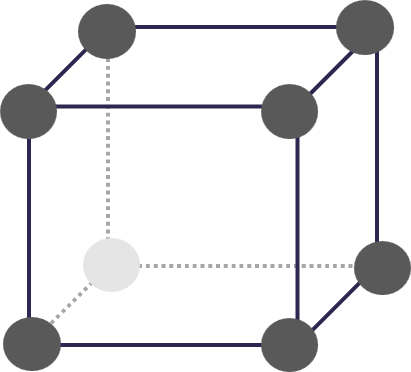
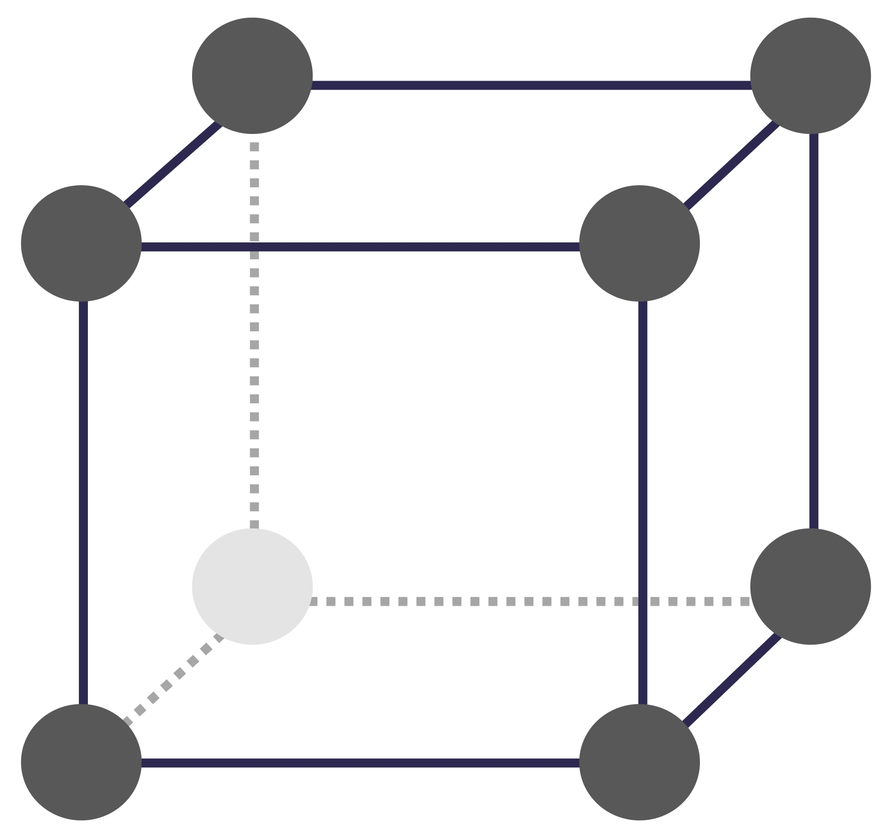
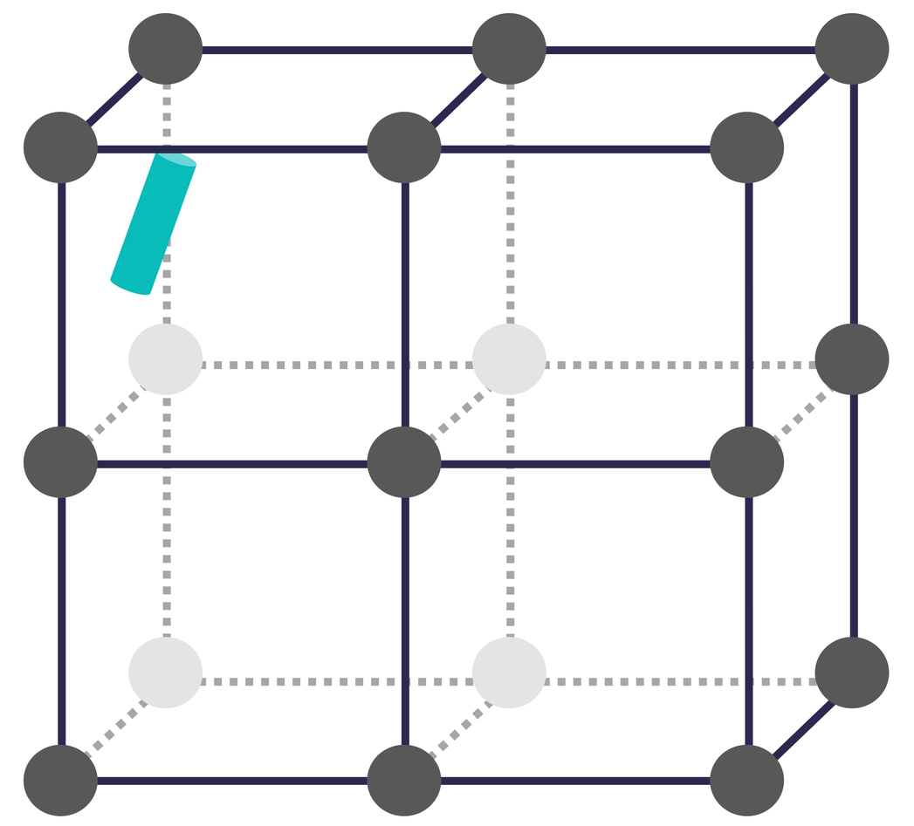
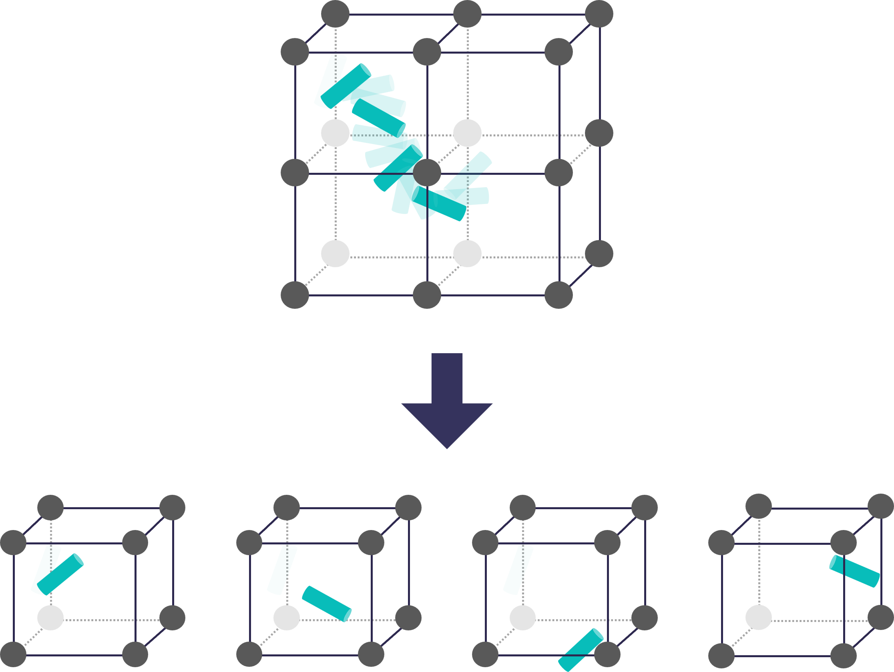

# Modeling and simulation

> **Section numbering note.** The methodology is documented across three files. Sections 1--3 appear in [system-preparation](../system-preparation/system-preparation.md); sections 4--5 appear here; sections 6--7 are in [energetic-data-analysis](../energetic-data-analysis/energetic-data-analysis.md).

## Scope and central metric

The central question of this thesis is whether MOF framework topology alone can modulate the selective adsorption of small organic guest molecules when chemical composition is held constant across the host series. Selective separation in MOFs can arise from multiple mechanisms, such as size exclusion, diffusion kinetics, and differential host-guest interactions, but all of them ultimately reflect differences in how strongly and preferentially a framework retains one molecule relative to another. This study isolates the **interaction energy contribution** to adsorption selectivity, quantified through the **binding energy** (BE):

<a id="binding-energy-equation"></a>
$$BE = E_{\text{complex}} - (E_{\text{host}} + E_{\text{guest}})$$

where all three terms are gas-phase electronic energies evaluated at the GFN1-xTB level of theory on optimized geometries. A more negative BE indicates a more stable host-guest configuration. The following scope limitations apply throughout:

- All calculations are performed **in vacuum**, without solvation, thermal, or zero-point energy corrections. The BE therefore corresponds to a **gas-phase electronic interaction energy**, not a thermodynamic adsorption enthalpy or free energy. No PV correction is applied; the quantity is an electronic energy difference analogous to $\Delta U$ at 0 K and should not be interpreted as $\Delta H$ or $\Delta G$.
- Selectivity is assessed via the **minimum BE** identified across all sampled and subsequently optimized configurations for a given host-guest pair. This value represents the most favorable interaction geometry accessible to the combined sampling procedure at the GFN1-xTB level; it is not a Boltzmann-weighted ensemble average and does not correspond to a thermodynamic adsorption free energy.
- The **host framework is treated as rigid** during all complex generation and MD simulation steps. Lattice parameters and atomic positions are fixed throughout sampling; host degrees of freedom are relaxed only in the final geometry optimization of selected candidates, which is described in the next section (see [energetic-data-analysis](../energetic-data-analysis/energetic-data-analysis.md)).
- The BE is defined for **one guest molecule per host unit cell**, corresponding to the infinite-dilution limit. Guest-guest interactions, cooperative adsorption, and pore blocking are not considered.

These simplifications define this work as a **gas-phase electronic interaction energy screen**: a topology-dependent ranking of host-guest affinities based on the most favorable adsorption geometry accessible to the sampling procedure. Configurational entropy, solvation, competitive adsorption, and diffusion kinetics are explicitly outside the scope of this model and are identified as directions for future work.

---

> ## The sampling problem
>
> The BE defined above is not a fixed property of a host-guest pair; it depends critically on the position and orientation of the guest within the pore. The potential energy surface (PES) of a host-guest system is high-dimensional, non-convex, and highly irregular: small displacements in position or orientation can produce large changes in interaction energy, and the surface contains multiple local minima separated by barriers of varying height.
>
> Finding the global minimum of this surface by exhaustive search is computationally intractable; any practical strategy must accept that the identified minimum is an **approximation** to the true global minimum. The goal of the sampling stage is therefore not to guarantee discovery of the global minimum, but to maximize the probability of finding a low-energy configuration within a finite computational budget.
>
> Two complementary strategies were employed.
>
> **Stochastic rigid-body docking (SRD)** places the guest at uniformly random positions and orientations within the host unit cell, without any energetic guidance. Because placements are unweighted, SRD provides broad and unbiased coverage of rigid-body configurational space. This breadth is its principal advantage: it can in principle reach any accessible region of the pore, including sites that are separated from other low-energy regions by high barriers. However, the fraction of the unit cell volume corresponding to geometrically and energetically meaningful host-guest contact is small relative to the total accessible volume, making random insertion statistically inefficient for a given sample size.
>
> **Classical molecular dynamics (MD)** propagates the guest through the pore under a classical force field, introducing energetic guidance: non-bonded interactions steer the guest toward regions of lower potential energy over the course of the trajectory. This makes MD more likely than SRD to dwell in low-energy basins within a given computational budget. However, two important caveats apply. First, the force field used for MD (UFF4MOF/GAFF2) defines a different PES from the GFN1-xTB surface on which binding energies are ultimately evaluated; the force field guides sampling in its own energy landscape, which need not coincide with the GFN1-xTB landscape. Second, ergodic sampling is not guaranteed within the finite simulation time: the guest may become trapped in a local minimum of the force-field PES, particularly for larger or more rigid molecules. The minimum identified from MD should therefore be interpreted as the lowest-energy configuration **accessible to the force field within that trajectory**, not as the true thermodynamic ground state or the GFN1-xTB global minimum.
>
> Critically, **neither method computes binding energies directly**. Both serve exclusively as **configuration generators**: they produce structural snapshots of the host-guest complex, and all binding energies are evaluated post hoc via GFN1-xTB single-point energy (SPE) calculations. This ensures a consistent quantum-mechanical energy reference across all configurations, hosts, and guests regardless of the sampling method used. The two-method design exploits the complementary strengths of each approach: SRD provides unbiased spatial coverage including sites that may be kinetically inaccessible to MD; MD preferentially populates energetically favorable regions of the force-field PES, which broadly, though imperfectly, correlates with the GFN1-xTB landscape.

---

## 4. Structural characterization

Before generating host-guest complexes, isolated host and guest structures are characterized through geometric and chemical descriptors. These descriptors provide a quantitative basis for interpreting topology-dependent binding energy trends and enable correlation analysis between structural features and adsorption affinities.

Guest molecule descriptors were computed using the [mof-guest-toolkit](https://github.com/adricu12/mof-guest-toolkit), which uses **RDKit** to calculate molecular properties. Host framework descriptors were computed using [Zeo++ (version 0.3)](https://www.zeoplusplus.org/), which represents the void space of a periodic porous structure as a Voronoi graph.

<a id="table-descriptors-host-guest"></a>
<table>
  <tr>
    <td align="center" width="50%" valign="top">
      <div style="height:160px; display:flex; align-items:center; justify-content:center;">
        
      </div>
      <strong>Host framework descriptors</strong>
      <br><br>
      <table>
        <tr>
          <th>Descriptor</th>
          <th>Zeo++ flag</th>
        </tr>
        <tr>
          <td>Pore limiting diameter</td>
          <td><code>-res</code> &rarr; PLD</td>
        </tr>
        <tr>
          <td>Largest cavity diameter</td>
          <td><code>-res</code> &rarr; LCD</td>
        </tr>
        <tr>
          <td>Accessible surface area</td>
          <td><code>-sa</code></td>
        </tr>
        <tr>
          <td>Accessible volume</td>
          <td><code>-vol</code></td>
        </tr>
        <tr>
          <td>Probe-occupiable volume</td>
          <td><code>-volpo</code></td>
        </tr>
        <tr>
          <td>Pore size distribution</td>
          <td><code>-psd</code></td>
        </tr>
      </table>
    </td>
    <td align="center" width="50%" valign="top">
      <div style="height:160px; display:flex; align-items:center; justify-content:center;">
        
      </div>
      <strong>Guest molecule descriptors</strong>
      <br><br>
      <table>
        <tr>
          <th>Descriptor</th>
          <th>RDKit name</th>
        </tr>
        <tr>
          <td>Molecular weight</td>
          <td><code>MolWt</code></td>
        </tr>
        <tr>
          <td>Rotatable bonds</td>
          <td><code>NumRotatableBonds</code></td>
        </tr>
        <tr>
          <td>H-bond donors</td>
          <td><code>NumHDonors</code></td>
        </tr>
        <tr>
          <td>H-bond acceptors</td>
          <td><code>NumHAcceptors</code></td>
        </tr>
        <tr>
          <td>Aromatic rings</td>
          <td><code>NumAromaticRings</code></td>
        </tr>
      </table>
    </td>
  </tr>
</table>

In addition to the 2D RDKit descriptors tabulated above, the full RDKit 2D set
(`guests_descriptors2.csv`) and a set of **3D shape descriptors**
(`guest_descriptors_3d.csv`) are computed for all 37 guests; both are generated in
the [structural-characterization](../scripts/structural-characterization.ipynb)
notebook and used in the [results](../results/selectivity-assessments-results.md#82-guest-geometric-characterization).
The 3D descriptors are computed from each optimized geometry using the
mass-weighted inertia tensor and van-der-Waals radii:

- **Radius of gyration** (overall bulk):
$$R_g = \sqrt{\frac{\sum_i m_i\,\lVert \mathbf{r}_i - \mathbf{R}_\text{cm}\rVert^2}{\sum_i m_i}}$$
- **Normalized principal-moment ratios** (shape, size-independent), from the
  sorted eigenvalues $I_1 \le I_2 \le I_3$ of the mass-weighted inertia tensor:
$$\mathrm{NPR1} = I_1/I_3, \qquad \mathrm{NPR2} = I_2/I_3$$
  with shape assigned as **rod** ($\mathrm{NPR1}<0.2$, $\mathrm{NPR2}>0.8$),
  **disc** ($\mathrm{NPR1}+\mathrm{NPR2}<1.1$, $\mathrm{NPR2}<0.85$), or
  **intermediate** otherwise.
- **Long-axis extent** — the vdW-inflated span along the $I_1$ (smallest-moment)
  axis.
- **Minimum / maximum rotational width** — the narrowest and widest vdW-inflated
  caliper width of the cross-section projected onto the plane perpendicular to the
  long axis (rotating-calipers over orientation). The minimum is the relevant
  dimension for threading a pore aperture.

**Host cluster coordination.** The carboxylate coordination mode of each Zr₆
cluster (`carboxylate_coordination.csv`) is classified from the optimized host
CIFs under periodic boundary conditions: with a Zr–O cutoff of 2.9 Å and an O–C
cutoff of 1.65 Å, every carboxylate carbon (a C bonded to exactly two O) is
labelled **bridging** (its two oxygens coordinate two different Zr) or
**chelating** (both coordinate the same Zr); clusters per cell = (Zr atoms) / 6.

Host CIF files were converted to **CSSR** format for Zeo++ input using the [mof-guest-toolkit](https://github.com/adricu12/mof-guest-toolkit). All Zeo++ calculations used a probe radius of **1.55 Å** (approximating the kinetic radius of $N_{2}$), with `num_samples` set to 2,000 for surface area and 50,000 for all volumetric descriptors:

```bash
# Pore limiting diameter and largest cavity diameter
./network -ha -res output_host.res input_host.cssr

# Accessible surface area
./network -ha -sa 1.55 1.55 2000 output_host.sa input_host.cssr

# Accessible volume
./network -ha -vol 1.55 1.55 50000 output_host.vol input_host.cssr

# Probe-occupiable volume
./network -ha -volpo 1.55 1.55 50000 output_host.volpo input_host.cssr

# Pore size distribution
./network -ha -psd 1.55 1.55 50000 output_host.psd input_host.cssr
```

The full pipeline for this section is in the [structural-characterization](./../scripts/structural-characterization.ipynb) Jupyter notebook.

---

## 5. Host-guest complex generation

This stage is solely concerned with generating a diverse and representative set of structural configurations, that is, snapshots of the guest positioned inside the host pore. These configurations are subsequently passed to the energetic screening pipeline described in [energetic-data-analysis](../energetic-data-analysis/energetic-data-analysis.md). No binding energy ranking or geometry optimization is performed here.

### 5.1. Stochastic rigid-body docking (SRD)

<p align="center">
  
</p>
<p align="center"><em>Schematic representation of the stochastic rigid-body docking approach to host-guest complex generation.</em></p>

The SRD strategy is implemented using a modified version of the [`host_guest`](https://github.com/bafgreat/host_guest) package. The algorithm computes the convex hull of the accessible pore volume and places the guest center of mass within this region at a uniformly random position, then randomly rotates the guest until no interatomic overlap with framework atoms is detected. Both host and guest are treated as rigid bodies throughout. No energy-based acceptance or rejection criterion is applied: placements are purely stochastic, without Boltzmann weighting or Markov chain propagation. This distinguishes SRD explicitly from Monte Carlo sampling in the strict sense, where each trial move requires an acceptance criterion such as the Metropolis criterion. SRD is best understood as an **unweighted random search over rigid-body configurational space**.

Two modifications were made to the original `host_guest` source code for this work:

1. **User-defined random seeds**: support for specifying the random seed at run time, enabling full reproducibility; seed values are recorded in the output metadata and are available in [simulation-seeds.csv](../data/simulation-seeds.csv).
2. **HDF5 output format**: replacing the original JSON output with HDF5 encoding. For a representative system (MOF-545 + CBN, 20,000 configurations), a single JSON file occupies approximately 10 GB because every configuration record redundantly stores the full set of atom labels and lattice parameters alongside the Cartesian coordinates. Three such files (one per seed) would total approximately 30 GB. The HDF5 format stores atom labels and lattice vectors once as shared metadata and records only the coordinate arrays indexed by configuration ID, reducing the same dataset to approximately 43 MB -- a reduction of roughly 700-fold -- with lossless encoding and efficient random-access reads during downstream analysis.

Three independent runs with distinct random seeds were performed per host-guest pair.

**SRD configuration generation (per host-guest pair):**

1. Three independent runs of 20,000 rigid-body configurations each are generated (60,000 total per pair), one per random seed. Configurations are stored in HDF5 format.
2. A GFN1-xTB SPE calculation is performed on every configuration, yielding a raw interaction energy for each of the 60,000 poses.

The 60,000 configurations and their associated SPE values are passed directly to the energetic screening pipeline.

The `host_guest` package is invoked via the following command (from the mof-guest-toolkit CLI):

```bash
complexes_from_file HOST_CIF GUEST_XYZ -nc 20000 -s SEED
```

where `HOST_CIF` is the geometry-optimized host CIF file, `GUEST_XYZ` is the optimized guest XYZ file, `-nc` specifies the number of configurations, and `-s` sets the random seed for reproducibility.

Although this step can be executed on an HPC cluster, the `host_guest` package does not support parallelisation; all configurations are processed sequentially. A standard workstation is therefore sufficient for this step. Wall time varies substantially across host-guest pairs; guests with extended flexible chains in narrow pore environments exhibit particularly high placement rejection rates, as the rigid-body assumption prevents conformational accommodation and the fixed rotation budget is frequently exhausted without finding a clash-free orientation.

### 5.2. Molecular dynamics sampling (MD)

<p align="center">
  
</p>
<p align="center"><em>Schematic representation of the molecular dynamics approach to host-guest complex generation.</em></p>

The MD strategy uses classical molecular dynamics implemented in **LAMMPS (version 23Jun2022)**. Force field parameterization followed an established protocol for MOF-guest systems: the host framework was described with **UFF4MOF** with partial charges assigned via the **EQeq** method; guest molecules were parameterized with **GAFF2** with **RESP charges** derived from HF/6-31G(d) electron densities computed in ORCA (version 6.1.0) and processed with Multiwfn (version 3.8). LAMMPS-compatible topology files were generated using Antechamber, tLEaP (AmberTools 25), and the `amber2lammps` utility. The host framework was kept **rigid** throughout all MD runs by zeroing the forces on all host atoms at every step (`fix setforce 0.0 0.0 0.0`).

### 5.2.1. Generation of topology files

#### Host frameworks

Host partial charges were assigned using the [EQeq C++ implementation](https://github.com/danieleongari/EQeq). The code requires a specifically formatted CIF file; the formatting step is performed by the scripts in the [modeling-and-simulation](./../scripts/modeling-and-simulation.ipynb) Jupyter notebook. The compiled binary is invoked as:

```bash
# Compile once (GCC):
g++ EQeq_v1_00.cpp -o eqeq

# Run per host:
./eqeq [MOF]_formatted.cif
```

This produces three output files: `[MOF]_formatted.cif_EQeq_Ewald_1.20_-2.00.cif`, `.mol`, and `.pdb`. The CIF output, which contains the EQeq partial charges as an additional column, requires a second reformatting step (documented in the notebook) before it can be read by [lammps_interface](https://github.com/peteboyd/lammps_interface), which is used to write the LAMMPS data file for the host structure.

#### Guest molecules

Guest topology files were generated through a five-step pipeline: HF/6-31G(d) wavefunction calculation in ORCA, RESP charge fitting in Multiwfn, charge file formatting, GAFF2 atom-typing and parameter generation in Antechamber/parmchk2, topology assembly in tLEaP, and final conversion to LAMMPS format with `amber2lammps`.

**Step 1 -- HF/6-31G(d) single-point calculation (ORCA 6.1.0).**
The following input template was used for all 37 guest molecules:

```
! HF 6-31G(d) TightSCF KeepDens

%pal nprocs 4 end

%geom
  MaxIter 200
  MaxStep 0.1
end

* xyz 0 1 
<atoms_coords>
*
```

> **Note on geometry.** The ORCA input uses the GFN1-xTB-optimized guest geometry from [system-preparation](../system-preparation/system-preparation.md). The HF/6-31G(d) calculation is a single-point on this geometry; no re-optimization at the HF level was performed. The wavefunction is used solely to obtain the electron density for RESP charge fitting.

The calculation is run as:

```bash
orca [guest].inp > [guest].out
```

A Molden-format file required by Multiwfn is then generated from the ORCA output:

```bash
orca_2mkl [guest] -molden
```

This produces `[guest].molden.input`, which is read directly by Multiwfn.

**Step 2 -- RESP charge fitting (Multiwfn 3.8, Windows).**
RESP charges were fitted using Multiwfn 3.8 running on Windows. All 37 guests were processed in batch using a `.cmd` automation script. The menu path for the standard two-stage RESP fitting is:

```
Main menu > 7  (Population analysis and atomic charges)
           > 18 (Restrained ElectroStatic Potential (RESP) atomic charges)
           > 1  (Start standard two-stage RESP fitting)
```

This produces a `[guest].chg` file containing atom indices, Cartesian coordinates, and fitted RESP charges. The atom indices and coordinates are not required by Antechamber and are stripped prior to the next step; the formatting script is provided in the [modeling-and-simulation](./../scripts/modeling-and-simulation.ipynb) Jupyter notebook.

**Step 3 -- GAFF2 atom-typing and parameter generation ([AmberTools 25](https://ambermd.org/index.php)).**
Antechamber reads the ORCA output file directly using the `-fi orcout` format flag and assigns GAFF2 atom types, incorporating the external RESP charges from the `.chg` file:

```bash
antechamber -i [guest].out -fi orcout \
            -o [guest].resp.mol2 -fo mol2 \
            -c rc -cf [guest].chg \
            -at gaff2 -nc 0
```

Missing force field parameters are identified and supplemented with parmchk2:

```bash
parmchk2 -i [guest].resp.mol2 -f mol2 -o [guest].frcmod -s gaff2
```

**Step 4 -- Topology assembly (tLEaP, AmberTools 25).**
The mol2 and frcmod files are assembled into Amber topology and coordinate files using the following LEaP input:

```
source leaprc.gaff2
loadAmberParams [guest].frcmod
MOL = loadMol2 [guest].resp.mol2
check MOL
saveAmberParm MOL [guest].top [guest].crd
quit
```

Run as:

```bash
tleap -s -f leap.in
```

**Step 5 -- Conversion to LAMMPS format.**
The final LAMMPS data file is generated using the [amber2lammps](https://collaborating.tuhh.de/m-29/software/maxentrdf/-/blob/6e76eadc7d94ee6b4432bc9aeed463d498982031/tools/amber2lmp/amber2lammps.py) Python utility, which reads the `.top` and `.crd` files and writes a `data.[guest]` file in LAMMPS full atom format.

### 5.2.2. LAMMPS MD simulation setup

**Force field and simulation parameters:**

| Parameter | Value |
|-----------|-------|
| Host force field | UFF4MOF |
| Host charges | EQeq |
| Guest force field | GAFF2 |
| Guest charges | RESP (HF/6-31G(d)) |
| Non-bonded potential | `lj/cut/coul/long` |
| LJ cutoff | 12.0 Å |
| Long-range electrostatics | PPPM, 1.0×10<sup>-4</sup> accuracy |
| Mixing rules | Arithmetic (Lorentz-Berthelot) |
| Special bonds | AMBER |
| Integrator (equilibration) | NVT, Nose-Hoover thermostat |
| Integrator (production) | NVE |
| Timestep (equilibration) | 1.0 fs |
| Timestep (production) | 0.25 fs |
| Equilibration duration | 100 ps |
| Production duration | 10 ns |
| Supercell | 2×2×2 |
| Trajectory dump stride | every 10,000 steps (2.5 ps) |
| Frames dumped per trajectory | 4,000 |
| Frames passed to SPE pipeline | 400 (stride-10 subsampling) |

**Temperature series.** The primary purpose of MD in this pipeline is configurational sampling, not physical modeling of thermal equilibrium. To maximize pore-region coverage and reduce the risk of the guest becoming trapped in a single force-field energy basin, seven independent trajectories were run per host-guest pair at a series of temperatures: **three runs at 300 K** (with distinct random seeds, to assess seed sensitivity at physically relevant conditions) and **four additional runs at elevated temperatures of 600 K, 900 K, 1,200 K, and 1,500 K**. The elevated temperatures are physically unrealistic for adsorption in a MOF under experimental conditions; they are used here purely as a device to provide the guest with sufficient kinetic energy to overcome force-field energy barriers and access pore regions that would be inaccessible to a 300 K trajectory within the same simulation time. Each trajectory contributes 400 frames, giving **2,800 snapshots per host-guest pair** across the full temperature series.

**Protocol.** Each run begins with a conjugate-gradient minimization of the guest within the frozen host to remove steric clashes from the initial placement, followed by NVT equilibration at the target temperature for 100 ps (1.0 fs timestep, Nose-Hoover thermostat, $\tau = 100$ fs). Production dynamics are then run under NVE for 10 ns (0.25 fs timestep). The NVE ensemble was chosen for production rather than NVT because the purpose of this stage is to generate a diverse set of structural snapshots, not to sample a canonical ensemble at a well-defined temperature; removing the thermostat avoids thermostat-induced artifacts in the dynamics while preserving the kinetic energy imparted during equilibration.

LAMMPS is invoked as:

```bash
lmp -in in.[MOF]_complex-generation -log complex-generation.log
```

**Representative LAMMPS input** (shown for the 1,500 K trajectory of MOF-545 + trimethoprim; the temperature variable `T_equ` is adjusted to 300, 600, 900, 1,200, or 1,500 for each respective run):

```lammps
# --- MOF-545 host + trimethoprim guest : complex generation ---
log             log.MOF-545_trimethoprim_complex_generation_mi
units           real
atom_style      full
boundary        p p p
newton          on

pair_style      lj/cut/coul/long 12.0
pair_modify     mix arithmetic
special_bonds   amber

bond_style      harmonic
angle_style     hybrid fourier cosine/periodic harmonic
dihedral_style  harmonic
improper_style  fourier

neighbor        2.0 bin
neigh_modify    delay 0 every 1 check yes

read_data  ../../data.MOF-545_cond_dftb_geo-opt_EQeq           \
           extra/atom/types 10  extra/bond/types 11            \
           extra/angle/types 19  extra/dihedral/types 8        \
           extra/improper/types 0  extra/bond/per/atom 3       \
           extra/angle/per/atom 6  extra/dihedral/per/atom 11  \
           extra/improper/per/atom 0
read_data  ../data.trimethoprim_centered add append offset 9 147 638 3 0 group guest

group      mof subtract all guest
group      mobile union guest

kspace_style  pppm 1.0e-4
run           0

# Freeze host: zero forces and velocities on all MOF atoms
fix            holdMOF  mof setforce 0.0 0.0 0.0
velocity       mof set 0.0 0.0 0.0

# Conjugate-gradient minimization of guest within frozen host
min_style      cg
minimize       1.0e-6 1.0e-8 5000 20000

# NVT equilibration of guest
variable       T_equ equal 1500        # K -- adjusted per run (300/600/900/1200/1500)
variable       Tdamp equal 100.0       # fs
timestep       1.0                     # fs
velocity       guest create ${T_equ} 12341 mom yes rot yes dist gaussian
fix            zerodrift_equ guest momentum 100 linear 1 1 1
fix            thermostat_equ guest nvt temp ${T_equ} ${T_equ} ${Tdamp}

dump           eq_all all custom 1000 eq.lammpstrj id mol type q x y z ix iy iz
dump_modify    eq_all sort id
run            100000                  # 100 ps at 1 fs/step
unfix          thermostat_equ
unfix          zerodrift_equ
undump         eq_all

# NVE production
variable       dt equal 0.25          # fs
timestep       ${dt}
variable       runtime_ns equal 10.0
variable       Npr equal ceil(v_runtime_ns*1.0e6/v_dt)   # = 40,000,000 steps

fix            integrate guest nve

# Dump every 10,000 steps -> 4,000 frames over 10 ns
dump           pr_all all custom 10000 nve.lammpstrj id mol type q x y z ix iy iz
dump_modify    pr_all sort id

thermo_style   custom step temp pe etotal press vol
thermo         10000

run            ${Npr}
unfix          integrate
write_restart  complex_generation.rst
```

### 5.2.3. MD trajectory snapshot extraction

Frames are dumped every 10,000 production steps (2.5 ps), producing 4,000 frames per trajectory. Prior to subsampling, RMSD was computed over the full 4,000-frame trajectory as a routine structural inspection; because decorrelation behavior varied across host-guest pairs, a fixed stride-10 subsampling was adopted as a standardized protocol, selecting every tenth frame and yielding 400 frames per trajectory passed to the SPE screening pipeline. The effective snapshot interval is therefore 25 ps. For each selected snapshot, the guest molecule and the single primitive host unit cell in which the guest center of mass resides are extracted from the 2×2×2 supercell trajectory. When the guest molecule straddles a periodic boundary, coordinates are reconstructed under the minimum-image convention prior to extraction to ensure a geometrically intact host-guest pair is passed to the SPE. Autocorrelation analysis at multiple stride intervals was performed as a supplementary check and confirmed that the stride-10 selection produces structurally distinct frames across the trajectory set; this does not constitute a rigorous ergodicity test but provides a practical guard against redundant snapshots propagating into the screening pipeline.

<p align="center">
  
  <br>
  <em><b>Figure 4.</b> Schematic of the snapshot extraction procedure: 4,000 frames dumped per trajectory at 2.5 ps intervals, with stride-10 subsampling yielding 400 frames per trajectory passed to the SPE screening pipeline.</em>
</p>

The 2,800 snapshots and their associated metadata are passed to the energetic screening pipeline. The full pipeline for MD setup, execution, and snapshot extraction is documented in the [modeling-and-simulation](./../scripts/modeling-and-simulation.ipynb) Jupyter notebook.

---
<br>

<div align="right">
  <a href="../energetic-data-analysis/energetic-data-analysis.md">>  Go to next: energetic-data-analysis</a>
</div>


<div align="left">
  <a href="../system-preparation/system-preparation.md"> Go to previous: system-preparation < </a>
</div>