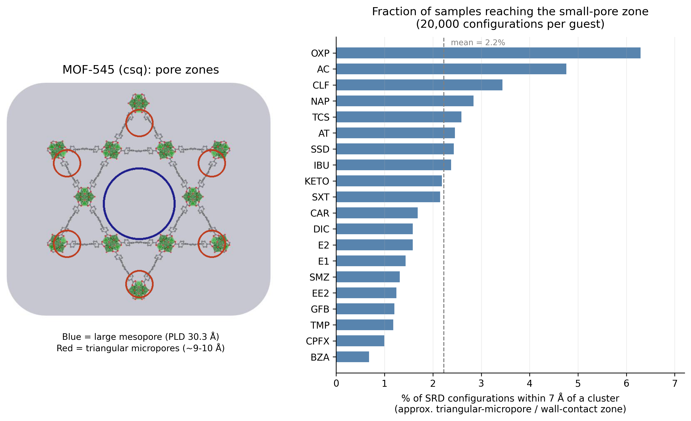
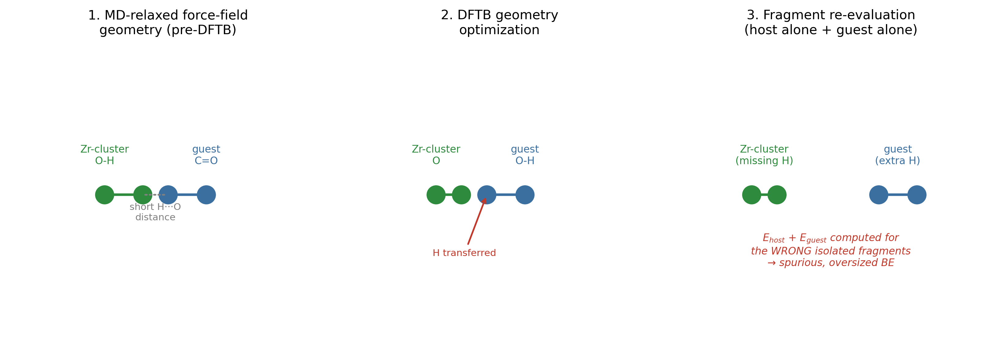
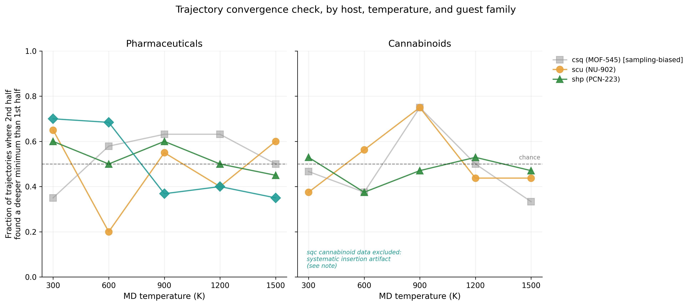

# Method assessment

This document assesses the two configuration-sampling strategies — stochastic rigid-body docking (SRD) and molecular dynamics (MD) — as inputs to the GFN1-xTB binding-energy screen. It complements the selectivity results in
[`selectivity-assessments-results.md`](./selectivity-assessments-results.md) and draws on the diagnostics defined in
[`energetic-data-analysis.md` §6.4](../energetic-data-analysis/energetic-data-analysis.md#64-complementary-statistics-for-method-assessment).

> **Scope.** The bulk per-configuration data are not committed (see
> [`thesis/README.md`](../thesis/README.md)); the noise-level statistics shown
> here are computed in the [`energetic-data-analysis`](../scripts/energetic-data-analysis.ipynb)
> notebook. Figures are numbered continuing from the selectivity results
> ([`selectivity-assessments-results.md`](./selectivity-assessments-results.md), Figs 1–10).

---

## 1. What each sampler was actually asked to do

SRD and MD serve one purpose in this pipeline: generating a diverse pool of candidate host-guest configurations for subsequent GFN1-xTB geometry optimization and scoring. Neither sampler is expected to produce a thermodynamically meaningful ensemble on its own; that expectation should be set explicitly before judging either one, since most of the apparent "failures" discussed below are not failures at this task but problems that appear only once the candidates are handed to the optimization step that follows.

Judged against this narrow task, which was to generate varied, sterically reasonable starting geometries, **both samplers succeed**, but they succeed and fail in different and non-overlapping ways, which is the central point of this assessment.

## 2. SRD

SRD places a rigid guest at random positions and orientations within a fixed host. Its limitation has two distinct faces, visible in opposite extremes of the host series, and both are purely geometric rather than chemical. 

Fraction of configurations excluded by the +10 kcal/mol steric-clash threshold,
per host-guest pair and sampling method:

$$\%NL = \frac{\text{configurations excluded}}{N} \times 100$$

A higher %NL indicates a sampling method placing more guests in near-contact
geometries (e.g. SRD's rigid-body insertion in narrow pores).

  

<em><b>Figure 11.</b> Steric-clash noise level (% of sampled configurations with raw BE &gt; +10 kcal/mol) per framework for the pharmaceutical guests. A higher value means a larger fraction of near-contact, energetically meaningless placements.</em>

  

<em><b>Figure 12.</b> The same noise-level comparison for the cannabinoid guests.</em>

The rejection rate is highest for sqc (PCN-225, the smallest pore-limiting diameter, 6.7 Å) and lowest for the two intermediate frameworks, consistent with rigid-body insertion being a purely geometric, host-size-dependent problem: the tighter the pore, the more often a randomly oriented rigid guest simply does not fit. This is a sampling-coverage limitation. It does not corrupt the configurations that do survive — a SRD placement that clears the steric-clash threshold is a geometrically sensible starting point — it just means fewer such placements are found per attempt in a tight pore.

csq (MOF-545) shows a low clash rate in Figures 11–12, but for the opposite reason, and the low rate is itself a symptom of a different problem rather than evidence that SRD performs well there. Zeo++'s own pore size distribution for csq is sharply bimodal: a small-pore population around 9–10 Å (corresponding to the triangular micropores formed where three TCPP linkers converge) and a dominant peak at 31.6 Å (the large hexagonal mesopore), with the variance of csq's distribution roughly 25–40× larger than any of the other three hosts (Table 6, prior section). Because random insertion samples in proportion to *volume*, not to which region would best fit a given guest, and the mesopore's volume vastly exceeds the combined volume of the six triangular micropores, the overwhelming majority of SRD placements land in the open mesopore — far from any wall, and therefore rarely close enough to register as a steric clash, but also rarely close enough to register a meaningful interaction. Figure 13a marks both pore zones directly on the csq structure; Figure 13b quantifies, guest by guest, what fraction of 20,000 SRD configurations actually reach the small-pore zone (operationalized as configurations within 7 Å of a cluster, the approximate scale of the triangular-micropore environment).

**Figure 13.** (a) MOF-545 (csq) pore zones: the large central mesopore (blue) and the six triangular micropores (red) at the points where linker arms converge. (b) Fraction of SRD configurations, per pharmaceutical guest, reaching the small-pore zone (20,000 configurations each).

Across all 20 pharmaceuticals checked, a mean of only 2.2% of configurations reach the small-pore zone, ranging from 0.7% (BZA) to 6.3% (OXP, the smallest guest in the set). This is a direct, structurally grounded confirmation of the mechanism: SRD is not failing to find the triangular micropores because they are chemically unfavorable — it is failing to find them because they represent a small fraction of the total accessible volume that random insertion samples uniformly. Any minimum binding energy reported for csq is therefore overwhelmingly likely to originate from the mesopore region, not the micropore region, independent of which guest is being placed, and the low apparent "noise level" in Figures 11–12 for csq should not be read as a sign of clean sampling — it reflects too few close-contact attempts to clash, not a high success rate at finding genuine binding geometries.

SRD's failure mode is therefore entirely upstream of any energy evaluation in both directions (csq and sqc alike): it is about how many usable, wall-contact candidates are generated, not about whether the ones generated are trustworthy once found.

## 3. MD

MD does not have an equivalent clash problem at the sampling stage. A guest released into a host under thermal motion does not occupy the same space as host atoms by construction — that is a basic feature of a force-field potential with a repulsive core, not a property that needs separate validation. Every saved MD frame is, by definition, an energetically reasonable point on the force-field surface; there are no sterically impossible MD configurations in the way there are sterically impossible SRD placements.

This is precisely why MD frames were able to reach the small-cage, wall-contact regions of csq's pore that SRD could not: thermal motion let the guest migrate away from its central starting point toward a wall over the course of the trajectory, accessing configurations no rigid-body placement would have found by chance. As a configuration generator, MD is strictly more capable than SRD at reaching chemically relevant geometries in difficult hosts.

The problem is not generation — it is what happens when those force-field-relaxed geometries are handed to GFN1-xTB for optimization and scoring. UFF4MOF (host) and GAFF2 (guest) are classical force fields with a fixed, pre-assigned bond topology: an oxygen on the cluster and an oxygen on the guest are never going to bond to each other in a force-field simulation, because the force field has no mechanism to form a bond that wasn't specified at setup. GFN1-xTB has no such restriction. It is a quantum-mechanical-based method that determines bonding from the electronic structure of whatever geometry it is given, with no memory of which atoms "belong" to the host and which to the guest.

When an MD frame places a guest heteroatom unusually close to a cluster μ₃-OH hydrogen — a close contact that is perfectly stable and unremarkable under the force field, since nothing in UFF4MOF/GAFF2 prevents two formally non-bonded atoms from sitting near each other — GFN1-xTB geometry optimization can respond very differently: it may pull that hydrogen away from the cluster oxygen entirely and onto the guest oxygen, because the resulting electronic structure is a genuine, lower-energy stationary point in DFTB's own potential. Figure 14 illustrates the mechanism.

**Figure 14.** Schematic of the fragment-misassignment artifact: a force-field-stable close contact in an MD frame is resolved by DFTB optimization as a hydrogen transfer, after which the host and guest fragments evaluated separately no longer correspond to the same atoms as in the complex.

Binding energy in this pipeline is computed as $BE = E_{complex} - (E_{host} + E_{guest})$, where $E_{host}$ and $E_{guest}$ are obtained by separating the optimized complex back into its two fragments and re-evaluating each in isolation. This formula implicitly assumes the atom-to-fragment assignment is the same before and after optimization. If a proton has actually migrated from the cluster to the guest during optimization, that assumption is false: the "host" fragment evaluated in isolation is missing a hydrogen it had in the complex, and the "guest" fragment has gained one it didn't start with. Neither isolated-fragment energy corresponds to a real chemical species consistent with the optimized complex, and the resulting binding energy is not a measure of any real noncovalent interaction — it partly reflects the energy of an unaccounted-for bond-breaking and bond-forming event. This is the direct, mechanistic explanation for the known outlier binding energies in this dataset (BZA/scu at −254.8, KETO/sqc at −248.2, BZA/sqc at −195.5, CPFX/sqc at −188.4, OXP/scu at −133.9 kcal/mol) — each 2–4× the typical magnitude found elsewhere in the dataset, consistent with a spurious bond contribution stacked on top of an otherwise ordinary noncovalent interaction, rather than with any physically plausible binding mode.

This failure mode does not require MD specifically — any starting geometry with a sufficiently close host-guest contact could trigger it during DFTB optimization, including occasional close SRD placements — but it is disproportionately associated with MD-sourced candidates precisely because MD's advantage (reaching close, wall-contact configurations that SRD rarely finds) is the same property that puts those configurations at risk of triggering this artifact. The configurations most informative about real binding are therefore also the ones most exposed to this failure mode, which is a genuinely awkward methodological tension: discarding all close-contact configurations to avoid the artifact would also discard the chemically interesting ones.

Comparing the deepest minimum binding energy found in the first half of each trajectory against the second half, for every available guest/temperature combination (97 trajectories in csq alone; equivalent checks run for scu, shp, and sqc) gives a measurable value that helps to identify if a trajectory has converged. For a converged trajectory, the two halves should find comparably deep minima; if the second half systematically finds deeper minima than the first, the window may be cut off before the guest has finished exploring accessible configuration space.

The cannabinoid trajectory data for sqc (PCN-225) was excluded from this check entirely: every frame in that file reports a binding energy in the tens of thousands of kcal/mol, with no negative (physically sensible) values at all, unlike the other three host/family combinations, which are 93–99.5% sane. This reflects a known issue specific to cannabinoid insertion in sqc's narrow pore: the initial placement protocol rotates the guest in place until clashes clear, which in a tight pore can leave the guest wedged into a single, highly constrained orientation with no accessible escape direction; the subsequent MD trajectory then has nowhere to relax to, and the resulting geometry is unstable under DFTB re-optimization in the same way described in §3. One additional single trajectory (CBNA in shp at 600 K) showed the same signature in isolation and was dropped individually rather than discarding the rest of an otherwise sound dataset.

**Figure 15.** Fraction of trajectories, by host and MD temperature, in which the second half of the trajectory found a deeper minimum binding energy than the first half. A value near 0.5 (dashed line) is consistent with a converged trajectory; values above 0.5 indicate the second half is still finding new, deeper minima more often than chance.

The result does not support a single, host-independent statement about trajectory adequacy. In csq, the elevated-temperature runs (600–1200 K) show a real, modest bias toward the second half finding deeper minima (58–63% of trajectories, versus 35% at 300 K), consistent with those runs still exploring new configuration space throughout the full 10 ns window, plausibly because, in csq specifically, a guest starting centrally has the farthest distance to migrate before reaching a wall (see §2), so the elevated-temperature runs that exist to speed up that migration may still be in the process of completing it even by the end of the trajectory. This pattern does not hold in the other three hosts: scu's 600 K runs are clearly converged by this test (only 20% find a deeper minimum in the second half), while sqc shows the opposite temperature dependence to csq, with its lowest-temperature runs (300–600 K) showing the most continued improvement late in the trajectory and its highest-temperature runs (900–1500 K) appearing converged. shp sits close to the 0.5 line at every temperature, showing no consistent signal either way.

Trajectory adequacy is inconsistent across the host series and across guest family rather than uniformly sufficient or uniformly insufficient, and the specific host/temperature combinations flagged above as still improving late in the trajectory (csq broadly, and csq/scu specifically at 900 K for cannabinoids) are the ones where extending the simulation window, if computationally feasible, would be most likely to change the reported minimum. The sqc exclusion is itself a finding worth carrying forward: insertion protocol matters as much as trajectory length, and a guest that is rotated into a single over-constrained pose before MD even begins cannot be rescued by a longer trajectory, since it never had anywhere to move to in the first place. A more careful initial-placement protocol for narrow-pore hosts, one that allows multiple candidate insertion orientations to be screened rather than committing to whichever orientation first clears the clash check, would likely be necessary before MD on sqc-cannabinoid pairs can be trusted at all.

## 4. Takeaways

- **Both samplers succeeded at the task they were given**: generating diverse, geometrically reasonable candidate configurations. SRD's limitation is coverage (it undersamples wall-contact regions in open pores and is rejected outright in narrow ones); MD has no equivalent generation-stage failure, since thermal motion does not produce sterically impossible configurations.

- **The serious failure mode is downstream, not at the sampling stage**: the force-field-to-DFTB handoff can misassign atoms between host and guest fragments when a force-field-stable close contact is resolved by DFTB as an actual bond-forming/bond-breaking event (most often a proton transfer to or from a cluster μ₃-OH). This produces binding energies 2–4× the typical magnitude in this dataset and is not physically meaningful.

- This failure mode disproportionately affects MD-sourced candidates, precisely because MD's main advantage over SRD, which are reaching close, wall-contact configurations, is also what exposes those candidates to it. The configurations most likely to be chemically informative are also the ones most likely to need this correction, which means the fix cannot simply discard close-contact structures.

- A **staged (two-step) optimization** that migrates a candidate geometry from the force-field basin into the DFTB basin gradually, rather than handing it directly to an unconstrained DFTB optimization, is the natural correction and has not yet been implemented.

- **Trajectory length adequacy was tested directly (first-half vs. 
second-half minimum comparison, Figure 15) and the result is host- and temperature-specific, not uniform.** csq's elevated-temperature runs (600–1200 K) show a real signal of continued improvement late in the trajectory; scu and sqc show the opposite pattern at their own respective temperatures; shp shows no consistent signal either way. There is no single correct statement about whether "10 ns is enough" for this dataset, some specific host/temperature combinations would likely benefit from a longer window, and others already appear converged.

- None of the above overturns the comparative, cross-topology conclusions in the selectivity results, which are not sensitive to the absolute accuracy of any single outlier energy. They do mean that minima sourced from MD candidates should be individually checked for the fragment-misassignment signature (anomalous magnitude relative to the rest of the dataset) before being reported without qualification, and that a DFT benchmark on a representative subset would help bound the absolute accuracy of the DFTB screen generally, separate from this artifact.

