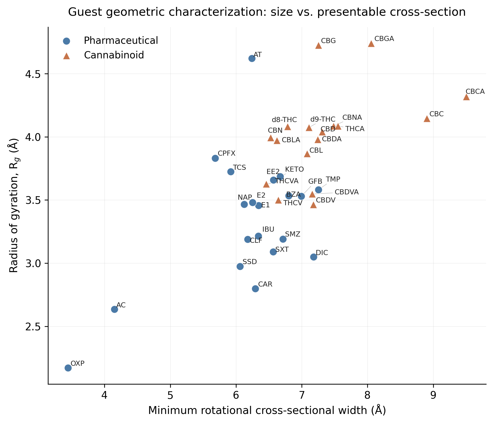
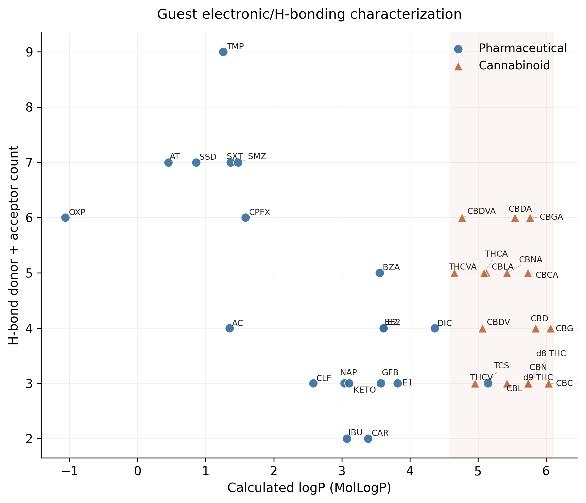
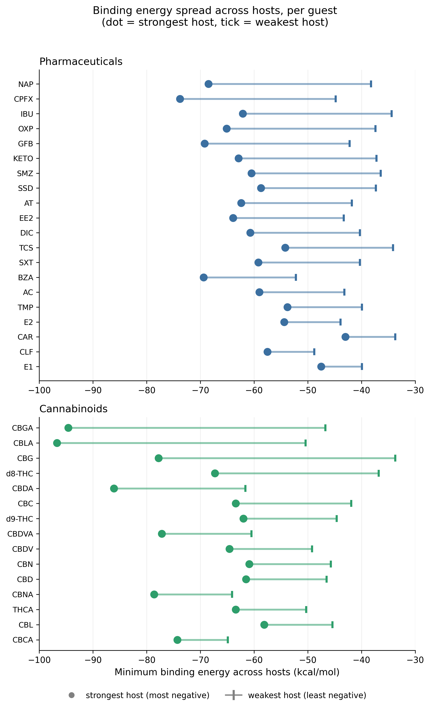
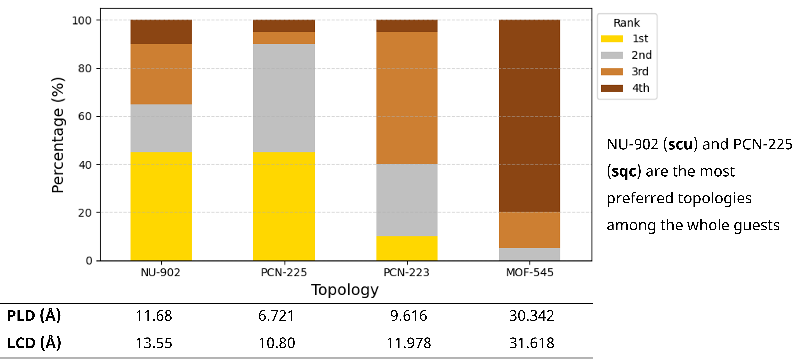
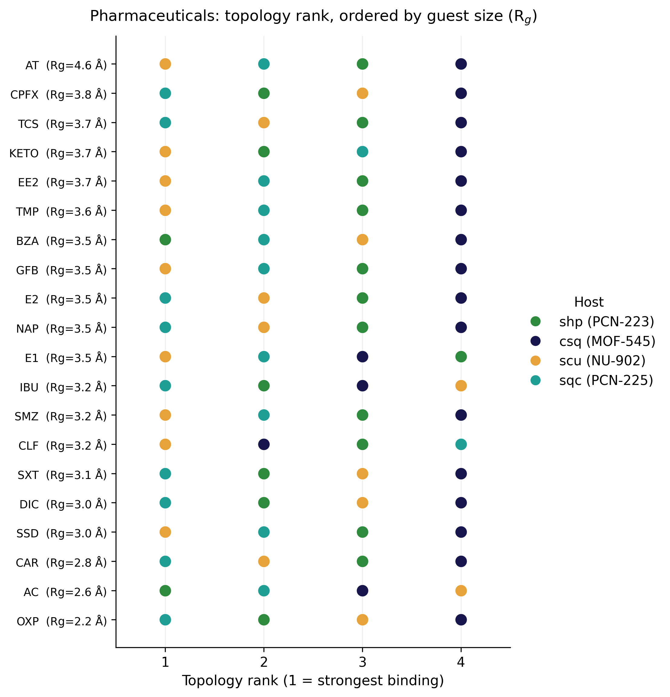
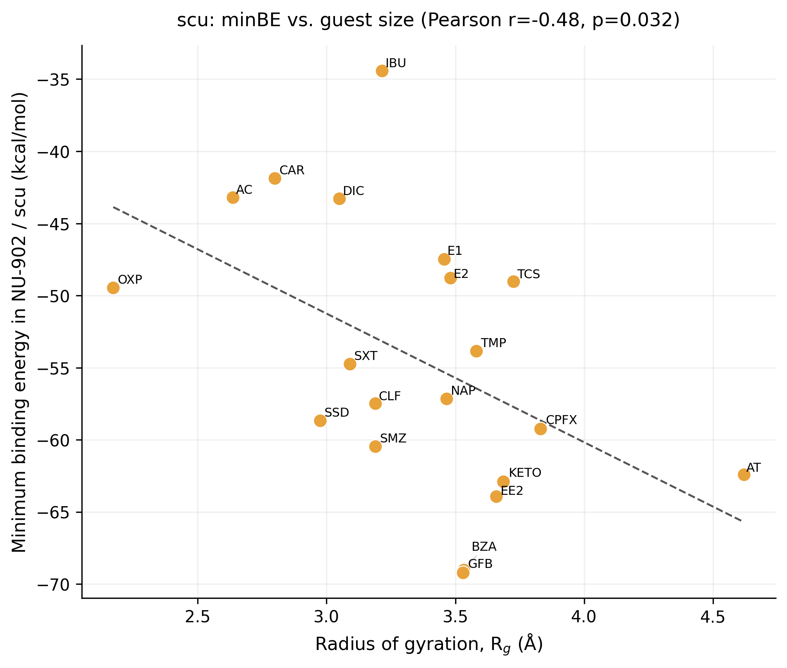
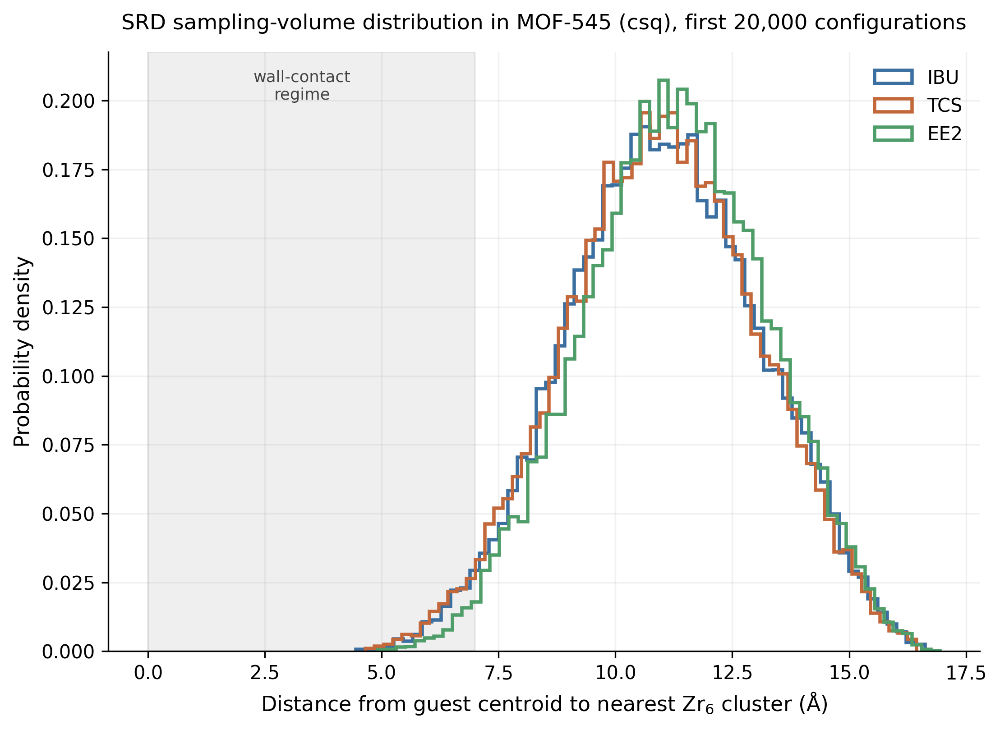
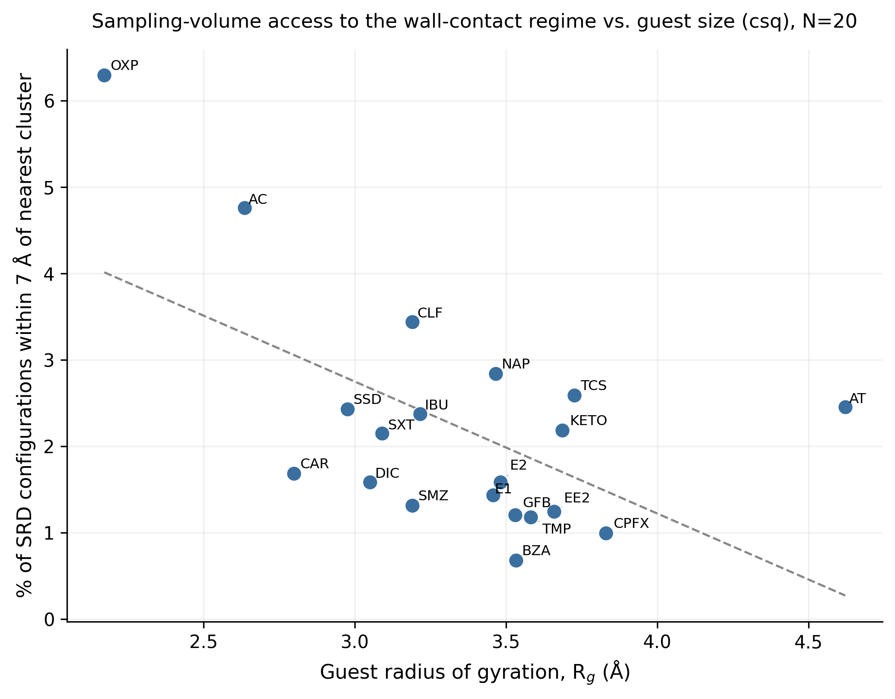
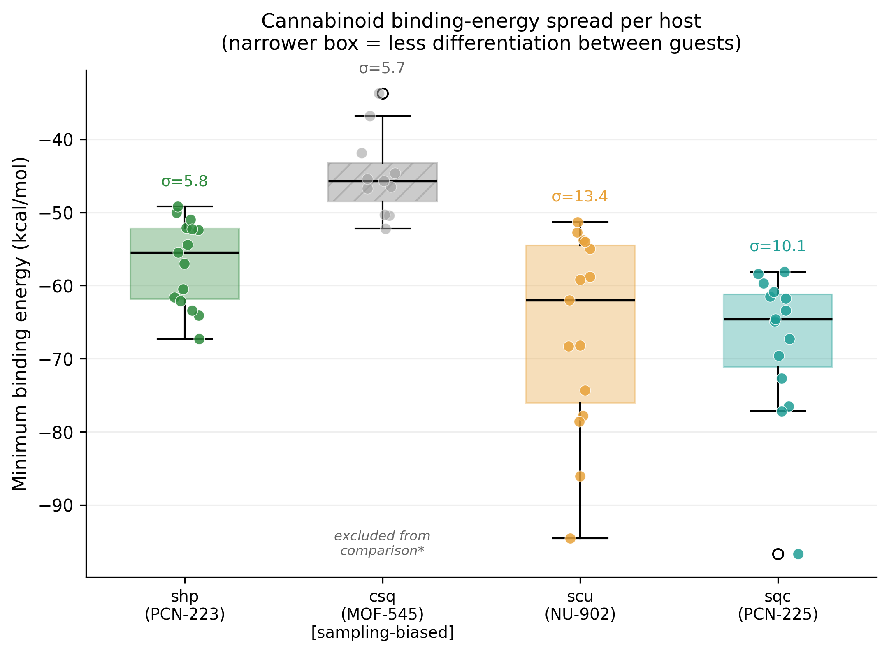
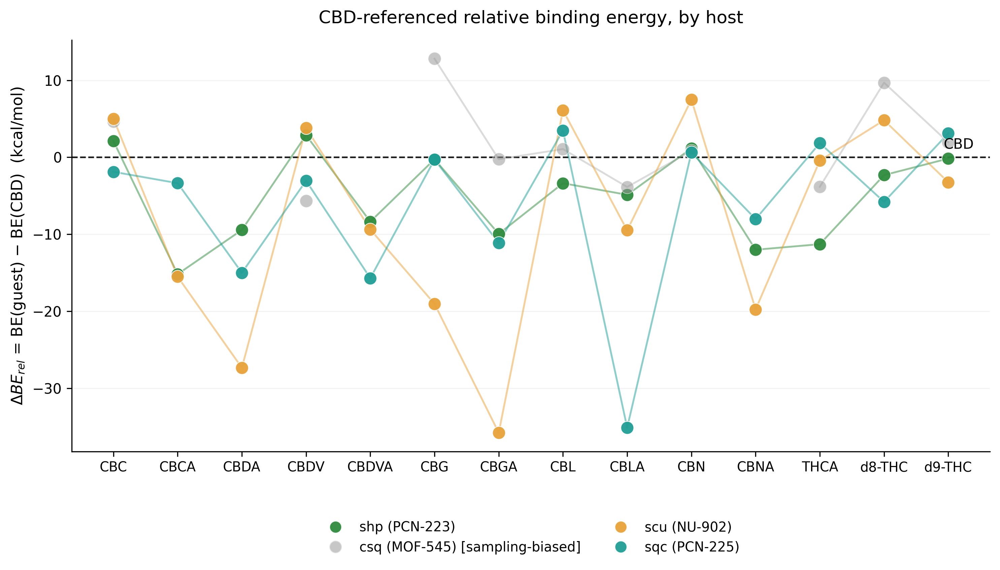

# Selectivity assessments and results

## Overview

This section reports the minimum binding energies obtained across the four topologies and 37 guests (136 of the 148 nominal host-guest pairs converged; see §9) and the selectivity analysis derived from them. All values are gas-phase electronic interaction energies at the GFN1-xTB level of theory on fully relaxed host-guest geometries, as described in [energetic-data-analysis.md](../energetic-data-analysis/energetic-data-analysis.md). The analysis is divided into host and guest structural characterization, pharmaceutical selectivity, and cannabinoid selectivity.

---

## 8. Structural characterization of host frameworks and guest molecules

### 8.1. Host framework descriptors

#### From net abstraction to pore geometry

The four isoreticular Zr-MOFs studied here — MOF-545, NU-902, PCN-223, and PCN-225 — adopt the csq, scu, shp, and sqc topologies respectively, all built from the same two units: the Zr₆ oxo-cluster and the tetratopic TCPP linker. In the reduced net representation, TCPP becomes a 4-connected node and the cluster becomes an 8- or 12-connected node, depending on how many carboxylates coordinate to it. Three of the four nets (csq, scu, sqc) share 8-connected clusters; PCN-223 (shp) is the outlier with 12-connected clusters. Table 1 summarizes the RCSR topological descriptors for all four nets.

**Table 1. RCSR topological descriptors for the four Zr-porphyrinic nets.**

| Net | Cluster CN | Space group | Genus | td10 | Density (vertices/vol.) | Cluster vertex symmetry (order) | TCPP vertex symmetry (order) | Tiling |
|-----|:---:|-----|:---:|:---:|:---:|:---:|:---:|-----|
| csq | 8  | P6/mmm   | 16 | 1812 | 0.8437 | mmm (8)    | mm2 (4)  | 3[4⁴] + 4[4³·6²] + 2[4⁶·12²] |
| scu | 8  | P4/mmm   | 6  | 1763 | 0.9743 | 4/mmm (16) | mmm (8)  | [4⁴] + 2[4⁴·8²] |
| shp | 12 | P6/mmm   | 9  | 3272 | 1.5000 | 6/mmm (24) | mmm (8)  | 4[4³·6²] + [4⁶] |
| sqc | 8  | I4₁/amd  | 11 | 2367 | 1.2178 | -4m2 (8)   | 2/m (4)  | 2[4³·6²] + [4²·6⁴] |

*Source: RCSR (rcsr.net/nets/{csq,scu,shp,sqc}), accessed June 2026. Genus, td10, and density are net-level invariants as reported in the RCSR summary table; vertex symmetry refers to the site symmetry of the high-connectivity (cluster) and low-connectivity (TCPP) vertex respectively, with point-group order given in parentheses.*

A connectivity label alone (8-c or 12-c) does not explain why csq, scu, and sqc are three distinct topologies despite sharing the same cluster connectivity. The RCSR vertex symmetries in Table 1 hint at a real structural difference (mmm vs. 4/mmm vs. -4m2 are progressively lower-order point groups), but the symbol alone does not say *why* the symmetry differs, since the cluster's own coordination chemistry is identical across the three.

#### Cluster-level connectivity: bridging and chelation

To resolve this, the optimized cluster coordination environments of all four GFN1-xTB-relaxed structures were analyzed directly, classifying every carboxylate as either μ₂-bridging (its two oxygens bonded to two different Zr atoms across an octahedron edge) or chelating (both oxygens bonded to the same Zr). This analysis is independent of the RCSR net-level description and is based on Zr–O and O–C distance criteria applied directly to the optimized geometries (Zr–O cutoff 2.9 Å, O–C cutoff 1.65 Å, periodic boundary conditions applied throughout).

The Zr₆ octahedron has 12 edges (Zr–Zr distances of ~3.3–3.8 Å) and 3 mutually opposite, non-bonded "trans" pairs (Zr–Zr distances of ~4.8–5.3 Å). For all three 8-connected nets, the analysis shows an identical combinatorial pattern: **8 of the 12 edges are bridged by carboxylates, and the remaining 4 form a closed four-membered loop ("belt") around one pair of trans vertices, which is left unbridged.** No chelation occurs in csq, scu, or sqc; all eight connections per cluster are genuine edge-bridges.

**Table 2. Carboxylate coordination mode per cluster, from direct geometric analysis of optimized structures.**

| Net | Carboxylates/cluster | Bridging (μ₂) | Chelating | Unbridged octahedron edges |
|-----|:---:|:---:|:---:|:---:|
| csq | 8  | 8  | 0 | 4 (belt) |
| scu | 8  | 8  | 0 | 4 (belt) |
| sqc | 8  | 8  | 0 | 4 (belt) |
| shp | 12 | 8  | 4 | 0 |

There are only three possible "belt" choices on an octahedron, one for each way of selecting which trans pair is excluded; csq, scu, and sqc each realize this same local solution, just with the belt positioned differently relative to the net's other symmetry elements. This is the structural origin of the progressively lower cluster vertex symmetry going from scu (4/mmm) to csq (mmm) to sqc (-4m2): the bare coordination chemistry of the cluster is unchanged in all three, and the differing point-group label records how the embedding net's other symmetry operations happen to align with (or break away from) this identical local connectivity pattern, not a difference in the cluster's own chemistry. The three nets are therefore distinguished by how the linkers connecting to neighbouring clusters are oriented in three-dimensional space around an otherwise identical local solution, a distinction the connectivity label and the bare vertex symmetry symbol do not by themselves convey.

PCN-223 (shp) departs from this picture structurally, not just numerically. Its 12 connections are not produced by bridging all 12 octahedron edges. The same 8 belt-to-pole edges found in csq, scu, and sqc are bridged identically, while the 4 additional connections are supplied by chelation at the 4 belt-vertex zirconiums, one carboxylate arm per metal. Tracing each carboxylate back to its parent TCPP linker shows that this chelation is not distributed across multiple linkers' arms; a single, structurally distinct TCPP sits in the equatorial belt plane and chelates all four belt zirconiums simultaneously, one arm to each, while the remaining TCPP linkers bridge edges exactly as in the 8-connected nets. The 12-connected node is therefore the 8-connected solution plus one added linker role that the lower-connectivity nets do not have, rather than a uniformly denser version of the same coordination chemistry. This is consistent with shp's distinct 6/mmm cluster vertex symmetry (order 24, the highest of the four): the four-fold chelating cap restores a symmetry axis through the belt that the bridging-only pattern alone would not preserve, which is why shp's cluster vertex symmetry is higher than any of the three 8-connected nets despite being the most highly connected cluster in absolute terms.

This added connectivity is also consistent with the genus and td10 gap between shp and the other three nets (Table 1). Genus counts independent topological cycles, and td10 is a cumulative coordination-shell count; both are sensitive to the 4 extra chelating connections per cluster, since each adds a new closed circuit through the net and a faster path by which a vertex reaches its higher-shell neighbours. shp's td10 (3272) is nearly twice csq's (1812) and almost double sqc's (2367), reflecting this denser local connectivity.

#### From tiling to pore geometry

The RCSR tilings (Table 1) translate this connectivity picture into the cage architecture that ultimately determines pore accessibility. csq's tiling contains three distinct cage types because csq's genus (16, the highest of the four) corresponds to the richest set of independent closed circuits, each closing into a geometrically distinct cage; its [4⁶·12²] cage, with two twelve-membered ring faces, is the direct topological origin of MOF-545's largest pore windows, and csq is the only one of the four nets whose tiling contains a ring larger than a hexagon. scu's tiling has no ring larger than an octagon; its [4⁴·8²] cage's two octagonal faces set NU-902's pore-limiting diameter, and because every face of both scu tiles is built exclusively from alternating TCPP and Zr₆ vertices, NU-902's pore interior is lined uniformly by this single repeating motif.

shp and sqc share their primary tile, [4³·6²], but diverge in their secondary cage: [4⁶] for shp, [4²·6⁴] for sqc. Taken as abstract ring counts alone, sqc's six-membered secondary-cage faces are larger than shp's four-membered ones, which would predict sqc to have the larger pore. The measured Zeo++ pore metrics (Table 3) invert this expectation.

**Table 3. Pore geometry descriptors from Zeo++ (1.55 Å probe radius), GFN1-xTB-optimized host structures.**

| Framework | Topology | Unit cell volume (ų) | PLD (Å) | LCD (Å) | ASA (m²/g) | AV (cm³/g) | POV (cm³/g) |
|-----------|----------|:---:|:---:|:---:|:---:|:---:|:---:|
| MOF-545   | csq      | 26,281.8 | 30.342 | 31.618 | 3032.69 | 1.287 | 1.722 |
| NU-902    | scu      | 6,497.1  | 11.680 | 13.550 | 3148.69 | 0.715 | 1.168 |
| PCN-223   | shp      | 6,717.5  | 9.616  | 11.978 | 2755.48 | 0.397 | 0.833 |
| PCN-225   | sqc      | 10,739.1 | 6.721  | 10.800 | 3069.53 | 0.434 | 0.889 |

sqc (PCN-225) has the smallest pore-limiting diameter of the four (6.72 Å), substantially below shp (PCN-223, 9.62 Å), despite PCN-225's unit cell (10,739 ų) being larger than PCN-223's (6,717 ų). Note that PCN-225 does not have the largest cell overall, but relative to shp specifically, the comparison is informative precisely because it rules out cell size as the explanation: a larger cell still produces the tighter bottleneck. The resolution is the space-group embedding, not the tiling itself: shp crystallizes in P6/mmm, realizing its four-membered secondary cage with the full hexagonal symmetry the net allows, while sqc's I4₁/amd space group introduces a 4₁ screw axis along the channel direction. That screw operation forces a helical rather than purely translational repeat of the six-membered ring as it propagates along the channel, which tilts and compresses the ring's physical aperture below what its topological ring size alone would suggest. This is a direct illustration that topological ring size and geometric pore aperture are related but not interchangeable descriptors: the same ring size can map onto very different physical dimensions depending on how the net is embedded in space.

This embedding effect explains why PLD and LCD diverge differently across the four frameworks. PLD, the narrowest constriction a guest must pass through along the diffusion path, is acutely sensitive to embedding distortions such as sqc's screw compression. LCD, the diameter of the largest internal cavity, is set by cage volume and is comparatively insensitive to how a window ring is twisted. This is why sqc's LCD (10.80 Å) sits much closer to shp's (11.98 Å) than its PLD does to shp's PLD (6.72 Å vs. 9.62 Å): the cage interiors are geometrically similar in scale, but sqc's access route into that cage is selectively narrowed by the screw embedding in a way shp's is not.

AV and POV track LCD and total cage volume reasonably well across the series; csq's exceptionally large LCD (31.6 Å) corresponds to its exceptionally large AV (1.287 cm³/g), roughly 3x the next-largest value (scu, 0.715 cm³/g) and more than 3x shp (0.397 cm³/g) and sqc (0.434 cm³/g). PLD, by contrast, governs accessibility rather than capacity: a framework can have a large internal cavity (high LCD, high AV/POV) while still excluding a guest at the entrance if the limiting window ring is narrow, exactly the regime PCN-225 occupies. This is the direct, geometry-level reason bulky pharmaceutical guests — for example carbamazepine, with a maximum molecular cross-section of approximately 9 Å — are excluded from PCN-225 under the rigid-framework assumption: the molecule may fit the cavity in principle but cannot pass the screw-compressed window to reach it.

### 8.2. Guest geometric characterization

#### Metrics used

Three-dimensional shape descriptors were computed directly from the optimized guest geometries (the same structures used as inputs to SRD and MD sampling), using the mass-weighted inertia tensor and van der Waals radii. These are listed in Table 4.

**Table 4. Geometric descriptors used for guest characterization.**

| Metric | Definition | Physical role |
|---|---|---|
| Rg | Mass-weighted radius of gyration | Overall molecular bulk, independent of shape or orientation |
| NPR1, NPR2 | Normalized principal moment-of-inertia ratios (I₁/I₃, I₂/I₃) | Classifies molecular shape as rod-, disc-, or sphere-like, independent of size |
| Minimum rotational width | The narrowest vdW-corrected cross-section the molecule can present when rotated about its own long axis | The relevant dimension for passing through a pore aperture in the most favorable orientation |
| Long-axis extent | vdW-corrected molecular length along the principal axis of smallest moment of inertia | Upper bound on the channel length a guest occupies when fully extended |

Rg and the rotational width answer different questions and are not substitutes for one another: Rg reflects how much space a guest occupies overall, while the rotational width reflects the narrowest opening the guest can still pass through, which depends on shape as much as size. A long, thin guest and a short, bulky guest can share the same Rg while presenting very different apertures, which is exactly the comparison the plot below is designed to show.

#### Size vs. presentable cross-section

**Figure 1.** Guest radius of gyration plotted against minimum rotational cross-sectional width, colored by chemical family. Each point is computed from the guest's own optimized geometry, independent of any host.

The two families separate along the size axis (Rg) more than along the cross-section axis: cannabinoids cluster at higher Rg (3.5–4.7 Å) than most pharmaceuticals (2.2–4.6 Å), consistent with their longer aliphatic side chains, but the two families overlap substantially in minimum rotational width (roughly 6–8 Å for the bulk of both groups). This means bulk alone does not separate the two chemical families in a way that would predict differential pore accessibility; a cannabinoid and a pharmaceutical of similar cross-sectional width can have markedly different Rg, and vice versa.

Atenolol (AT) is a clear outlier within the pharmaceuticals: the highest Rg of any pharmaceutical in the set, but a comparatively narrow cross-section (6.24 Å). This combination is explained by its shape rather than its size: AT has the lowest NPR1 in the entire dataset (0.07, with NPR2 = 0.99), the most rod-like geometry of all 37 guests. Its large Rg comes from being long, not from being bulky, and its narrow rotational width confirms that a rod can present a small aperture footprint despite a large overall extent. This is the general principle the Rg/cross-section pairing is meant to surface: Rg alone would flag AT as one of the largest guests in the set, while the cross-section metric shows it is not correspondingly difficult to thread through a narrow pore.

At the other extreme, CBGA and CBG combine high Rg with the largest cross-sectional widths in the set (8.05 Å and 7.25 Å respectively), making them the two guests most likely to be size-limited by a narrow host aperture on both dimensions simultaneously, rather than compensating length for width as AT does.

#### Shape classification

Guests were further classified by their NPR1/NPR2 pair into rod-, disc-, or intermediate-shaped, following the standard PMI triangle convention (rod: NPR1 < 0.2 and NPR2 > 0.8; disc: NPR1 + NPR2 < 1.1 and NPR2 < 0.85; intermediate: otherwise). No guest in the set classifies as sphere-like, which is expected given that all are organic molecules with at least one extended ring system or chain.

**Table 5. Shape classification summary.**

| Shape class | N guests | Examples |
|---|:---:|---|
| Rod | 12 | AT, CLF, NAP, E1, E2, KETO, IBU, EE2, TCS, AC, CBN, CBG |
| Disc | 4 | OXP, CPFX, CBLA, THCVA |
| Intermediate | 21 | most cannabinoid acids and neutral THC/CBD isomers, BZA, CAR, DIC, SSD, SXT, SMZ, TMP, GFB |

The rod-shaped group is dominated by pharmaceuticals with a single extended ring system or a short rigid chain (estrogens E1/E2/EE2, NAP, KETO, CLF), while most cannabinoids fall into the intermediate class, reflecting the bicyclic or tricyclic ring-plus-chain architecture shared across the cannabinoid scaffold. This is a more mechanistically grounded grouping than the pharmaceutical/cannabinoid label alone, since it groups guests by the geometry that actually governs pore threading rather than by chemical family, and a rod-shaped pharmaceutical (e.g., AT) has more in common geometrically with a rod-shaped cannabinoid (CBN) than with a disc-shaped pharmaceutical (CPFX).

#### Electronic and hydrogen-bonding characterization

The 3D shape metrics above describe whether a guest fits a pore; they say nothing about how strongly it interacts once inside. For that, the RDKit 2D descriptor set computed for all 37 guests provides the relevant electronic and hydrogen-bonding handles. Table 6 lists the non-redundant subset used, selected to span the major noncovalent interaction classes without duplicating closely correlated descriptors (e.g., TPSA was dropped in favor of the donor/acceptor counts directly, since the two are correlated at r = 0.86 and the counts are more chemically direct).

**Table 6. RDKit descriptors used for electronic/H-bonding characterization.**

| Descriptor | Interaction class probed |
|---|---|
| NumHAcceptors, NumHDonors | Directional hydrogen bonding to μ₃-OH and carboxylate oxygens on the cluster |
| MolLogP | Lipophilicity; proxy for dispersion-dominated, non-directional binding |
| NumAromaticRings | π-stacking capacity with the TCPP porphyrin face |
| NumRotatableBonds | Conformational adaptability during binding (distinct from the rigid-body shape metrics above) |
| MaxAbsPartialCharge | Electrostatic intensity at the most charged atom |

**Figure 2.** Guest calculated logP plotted against combined H-bond donor + acceptor count, colored by chemical family. The shaded band marks the cannabinoid LogP range (4.6–6.1).

Unlike the geometric plot, this descriptor pair separates the two chemical families almost completely. Every cannabinoid falls within a narrow LogP band (4.6–6.1), reflecting the shared hydrophobic terpenoid scaffold across the family, while pharmaceuticals span a much wider range (−1.1 to 5.1) reflecting their structural heterogeneity. Only one pharmaceutical, triclosan (TCS), falls inside the cannabinoid LogP band, consistent with its chlorinated, comparatively lipophilic structure. This makes LogP a substantially sharper family separator than any of the 3D geometric descriptors, where the two families overlapped considerably.

Within the cannabinoid cluster, the acidic derivatives (CBDA, CBGA, CBNA, CBLA, THCA, THCVA, CBDVA) are visibly offset from their neutral parents (CBD, CBG, CBN, CBL, d8/d9-THC, THCV, CBDV) by exactly one additional H-bond donor and one additional acceptor at comparable LogP, the direct signature of the added carboxyl group. This is the cleanest available within-family contrast for isolating the electrostatic contribution to binding energy independent of size or shape, since each acid/neutral pair is otherwise structurally near-identical: a binding energy difference within a pair is attributable to the carboxyl group's added H-bonding capacity rather than to a confounding change in bulk or cross-section.

Atenolol (AT) and trimethoprim (TMP) carry the highest H-bond counts in the entire set (7 and 9 respectively) at low LogP, marking them as the guests most likely to bind through directional electrostatic/H-bonding contacts with the cluster surface rather than through dispersion. This is consistent with, and gives a quantitative basis for, the qualitative claim already in the thesis that polar pharmaceuticals such as these interact preferentially through hydrogen bonding to the μ₃-OH groups.

---

## 9. Minimum binding energies

Minimum binding energies were obtained for 35 of the 37 guests (THCV and THCVA are absent due to insufficient SRD sampling convergence, as noted in the guest characterization section). Within this set, four cannabinoid acids (CBCA, CBDA, CBDVA, CBNA) lack a converged value specifically in MOF-545 (csq); all other host-guest pairs are complete. Table 7 summarizes the per-host distribution.

**Table 7. Minimum binding energy distribution by host (kcal/mol), all available guests.**

| Host | Topology | N | Mean | Std | Min | Max |
|------|----------|:---:|:---:|:---:|:---:|:---:|
| MOF-545 | csq | 31 | −42.4 | 5.5  | −52.2 | −33.7 |
| PCN-223 | shp | 35 | −53.4 | 7.6  | −69.4 | −39.9 |
| NU-902  | scu | 35 | −59.5 | 12.7 | −94.6 | −34.4 |
| PCN-225 | sqc | 35 | −61.8 | 10.2 | −96.7 | −43.0 |

### Collective shape: a sampling artifact, not a host ranking

Read uncritically, Table 7 would suggest MOF-545 (csq) is the weakest and most uniform binder of the four hosts: its mean is 11–19 kcal/mol less negative than the other three, and its spread (std 5.5) is roughly half that of scu or sqc. This pattern should not be interpreted as a genuine host-strength ranking. It is very likely an artifact of the stochastic rigid-body docking (SRD) sampling method interacting with csq's pore architecture, for a specific and identifiable reason.

csq's tiling (see Table 1) contains three structurally distinct cage types, including the large [4⁶·12²] mesoporous cage responsible for MOF-545's exceptionally large pore-limiting diameter (30.3 Å), alongside much smaller [4⁴] and [4³·6²] cages where a guest could sit in close contact with multiple pore walls simultaneously. SRD samples configurations by placing the guest at random positions and orientations within the host; because the large mesoporous cage occupies a disproportionate share of the total accessible pore volume, random insertion lands in that cage far more often than in the small triangular micropores, independent of which environment would actually produce the most favorable binding energy. The reported minimum binding energy for csq is therefore biased toward the cage that dominates the sampled volume, not toward the cage that best fits the guest. Given that the large cage places most guests too far from any pore wall to engage in close contact, this systematically suppresses the apparent binding strength and narrows the apparent spread, for a structural reason that has nothing to do with the guest's own chemistry.

The other three hosts (shp, scu, sqc) have much smaller and more size-comparable pore-limiting diameters (6.7–11.7 Å), making random insertion far more likely to probe genuine wall-contact configurations across the full pore in all three cases. Their three-way comparison is consequently on more comparable methodological footing than any comparison that includes csq, though it remains subject to the broader caveat below.

csq values are retained in all tables and figures in this section, but should be read as a lower-bound estimate biased by sampling-volume effects, not as a reliable measure of MOF-545's true binding capability. Any claim of the form "guest X binds more weakly in csq than in [host Y]" should be understood as a statement about this dataset's sampling outcome, not a structural conclusion about MOF-545.

### A broader caveat on what these numbers represent

Independent of the csq-specific sampling bias, the minimum binding energy reported throughout this section is not a measure of binding thermodynamics in any rigorous sense. The rigid-body assumption applies only to the SRD sampling stage: candidate configurations are generated by placing a rigid guest at random positions and orientations within a fixed host framework. Every reported binding energy, however, is the GFN1-xTB electronic energy of the full host-guest complex *after* geometry optimization of that complex as a whole, not a single-point evaluation of the unrelaxed SRD placement. Both host and guest geometries are free to relax together at this stage. What remains absent is solvent or competing species (the calculation is gas-phase, single-guest) and any entropic or thermal contribution (no vibrational, rotational, or translational free-energy correction is applied). These values should not be read as binding free energies, binding enthalpies, or any other thermodynamically defined quantity, and the absolute magnitudes are not directly comparable to experimental adsorption data. What follows is a comparison of relative rankings produced by this specific computational protocol, useful for identifying trends in guest-host preference within the dataset, not a measurement of true binding thermodynamics.

### 9.1. Family-level trend

With the above caveats stated, a consistent pattern emerges across the three hosts least affected by the csq sampling artifact (shp, scu, sqc): cannabinoids bind more strongly (more negative minimum binding energy) than pharmaceuticals on average, by 6–12 kcal/mol depending on host (Table 8). The difference is statistically significant in all three (Mann-Whitney U, p < 0.05).

**Table 8. Family-level mean minimum binding energy (kcal/mol) by host.**

| Host | Pharmaceutical mean | Cannabinoid mean | Difference | p-value |
|------|:---:|:---:|:---:|:---:|
| shp  | −50.8 | −56.9 | −6.0  | 0.017 |
| scu  | −54.3 | −66.3 | −12.0 | 0.021 |
| sqc  | −57.5 | −67.6 | −10.1 | 0.004 |

Cannabinoids also show a larger guest-to-guest spread across hosts than pharmaceuticals (mean range across shp/scu/sqc of 16.2 kcal/mol for cannabinoids versus 11.7 kcal/mol for pharmaceuticals), indicating that host identity discriminates more strongly among cannabinoid guests than among pharmaceutical guests within this dataset.

This spread has a direct selectivity interpretation: a guest whose binding energy varies widely across the four hosts is one for which host choice meaningfully discriminates, while a guest with a narrow spread binds with similar strength everywhere and is a poor candidate for topology-based separation regardless of which host is chosen. Figure 3 shows this directly, per guest, using the full four-host range (not restricted to shp/scu/sqc as in the paragraph above) since the spread itself, unlike the mean, is a within-guest comparison and is not distorted by the csq sampling bias in the same way an absolute magnitude would be.

**Figure 3.** Binding energy range across all four hosts, per guest, separated into pharmaceuticals (top) and cannabinoids (bottom). The filled circle marks the strongest (most negative) host; the tick marks the weakest.

The widest ranges in the entire dataset belong to CBGA (47.9 kcal/mol) and its neutral parent CBG (44.1 kcal/mol), followed by CBLA (46.3) and d8-THC (30.5). This is not a general acid-versus-neutral effect: splitting the cannabinoid family by acidic derivatives versus neutral parents gives nearly identical mean ranges (24.6 vs. 21.5 kcal/mol), both only modestly above the pharmaceutical mean (19.8 kcal/mol). The wide-spread guests are concentrated in specific chemical families (the CBG/CBGA pair and, separately, CBLA and d8-THC) rather than distributed evenly across all acidic or all neutral cannabinoids, and the narrowest-range cannabinoids (CBCA, CBL, CBNA, THCA) sit well inside the pharmaceutical range distribution. The family-level mean difference reported above is real, but it is driven by a handful of structurally specific guests rather than a uniform cannabinoid-wide property, and any claim about *why* CBG/CBGA or CBLA show this behavior specifically would need the guest-by-guest structural review addressed in the cannabinoid selectivity section, not the aggregate family statistic alone.

---

## 10. Pharmaceutical selectivity

The absolute minimum binding energy has no standalone physical meaning under this method: it is a single-guest, gas-phase electronic energy following full geometry optimization of the host-guest complex (the rigid-body assumption applies only to the SRD sampling stage that generates candidate starting configurations, not to the reported energy itself; see the collective-shape caveats above for the full distinction). What can be compared is whether, for a fixed host, guest-to-guest variation in binding energy tracks any property of the guest itself. This is tested host-by-host: for each of the four frameworks, the 20 pharmaceutical minimum binding energies are correlated (Pearson and Spearman) against ten guest descriptors spanning the major noncovalent interaction classes (hydrogen bonding, lipophilicity, aromaticity, flexibility, electrostatics, and 3D size/shape; see Tables 4 and 6 for definitions). This direction (N = 20 per host) has meaningfully more statistical power than correlating a single guest's four host-specific binding energies against host pore metrics (N = 4 per guest), which is the same small-sample regime already flagged as unreliable elsewhere in this work and is not repeated here as a formal correlation.

### 10.1. Overall topology preference

**Figure 4.** Distribution of topology rank (1st–4th, strongest to weakest binding) across all 20 pharmaceuticals, by host.

scu (NU-902) and sqc (PCN-225) are each ranked 1st for 45% of pharmaceuticals, together accounting for 90% of all 1st-place rankings. csq (MOF-545) is ranked 4th for 80% of pharmaceuticals and never ranked 1st. shp (PCN-223) sits predominantly at 2nd–3rd place. This aggregate view motivates the more detailed, per-guest analysis below: is csq's near-universal last place driven by guest chemistry, host chemistry, or a methodological artifact?

**Figure 5.** Topology rank (1 = strongest binding) for all 20 pharmaceuticals, ordered top-to-bottom by guest radius of gyration (Rg).

If guest size governed host preference, the four host columns would show visible drift across the figure: hosts favorable to small guests should cluster toward rank 1 near the bottom of the plot (low Rg) and toward rank 4 near the top (high Rg), or vice versa. csq (dark navy) shows no such drift: it sits at rank 3–4 for the large majority of guests regardless of where the guest falls on the size axis, including for OXP and AC, the two smallest pharmaceuticals in the set. This absence of a size-dependent pattern in csq is the central observation of this section, and is addressed directly below.

scu (orange) and sqc (teal) show more genuine spread across ranks, and sqc trends toward rank 1 more often at the lower end of the Rg axis (OXP, CAR, DIC, SXT, NAP, E2, TCS, CPFX), consistent with sqc's narrower pore favoring more compact guests. Clofibric acid (CLF) is a clear exception worth flagging directly: despite a below-median Rg (3.19 Å), CLF ranks 4th (weakest) in sqc and ranks 2nd in csq, the only pharmaceutical for which csq is not the worst- or near-worst-performing host. This reversal is the opposite of what guest size alone would predict, and is a candidate for the case-by-case structural review noted at the end of this section, rather than something the aggregate trend can explain.

### Host-by-host correlation: full results

Table 9 reports every correlation tested (10 descriptors × 4 hosts, Pearson and Spearman), not only the significant cells, since presenting a selected subset would misrepresent how sparse the signal actually is.

**Table 9. Pearson and Spearman correlations between pharmaceutical guest descriptors and minimum binding energy, by host (N = 20 per host).**

| host | descriptor | pearson_r | pearson_p | spearman_r | spearman_p |
|---|---|---:|---:|---:|---:|
| shp | NumHAcceptors | -0.22 | 0.351 | -0.41 | 0.076 |
| shp | NumHDonors | -0.38 | 0.103 | -0.38 | 0.103 |
| shp | MolLogP | 0.34 | 0.145 | 0.43 | 0.056 |
| shp | NumAromaticRings | -0.31 | 0.179 | -0.28 | 0.226 |
| shp | NumRotatableBonds | -0.38 | 0.094 | -0.30 | 0.202 |
| shp | MaxAbsPartialCharge | 0.04 | 0.854 | 0.18 | 0.440 |
| shp | Rg | 0.02 | 0.930 | -0.03 | 0.915 |
| shp | min_rot_width | 0.33 | 0.152 | 0.34 | 0.146 |
| shp | NPR1 | -0.14 | 0.556 | -0.03 | 0.915 |
| shp | NPR2 | 0.43 | 0.061 | 0.22 | 0.346 |
| csq | NumHAcceptors | 0.02 | 0.949 | -0.12 | 0.621 |
| csq | NumHDonors | -0.15 | 0.525 | -0.24 | 0.318 |
| csq | MolLogP | -0.04 | 0.854 | -0.04 | 0.860 |
| csq | NumAromaticRings | 0.41 | 0.071 | 0.46 | **0.041** |
| csq | NumRotatableBonds | -0.19 | 0.426 | -0.05 | 0.819 |
| csq | MaxAbsPartialCharge | -0.44 | 0.050 | -0.36 | 0.119 |
| csq | Rg | -0.18 | 0.455 | -0.14 | 0.556 |
| csq | min_rot_width | -0.02 | 0.943 | 0.01 | 0.980 |
| csq | NPR1 | 0.15 | 0.523 | 0.28 | 0.235 |
| csq | NPR2 | 0.01 | 0.952 | -0.12 | 0.613 |
| scu | NumHAcceptors | -0.35 | 0.135 | -0.43 | 0.060 |
| scu | NumHDonors | -0.16 | 0.514 | -0.17 | 0.486 |
| scu | MolLogP | 0.10 | 0.676 | 0.10 | 0.682 |
| scu | NumAromaticRings | -0.09 | 0.720 | -0.05 | 0.824 |
| scu | NumRotatableBonds | **-0.49** | **0.029** | -0.45 | **0.048** |
| scu | MaxAbsPartialCharge | -0.12 | 0.609 | 0.11 | 0.658 |
| scu | Rg | **-0.48** | **0.032** | **-0.53** | **0.016** |
| scu | min_rot_width | -0.30 | 0.197 | -0.28 | 0.240 |
| scu | NPR1 | 0.09 | 0.691 | 0.10 | 0.673 |
| scu | NPR2 | 0.07 | 0.778 | -0.03 | 0.885 |
| sqc | NumHAcceptors | -0.18 | 0.450 | -0.19 | 0.426 |
| sqc | NumHDonors | -0.39 | 0.085 | -0.35 | 0.136 |
| sqc | MolLogP | 0.23 | 0.331 | 0.11 | 0.659 |
| sqc | NumAromaticRings | -0.22 | 0.345 | -0.14 | 0.552 |
| sqc | NumRotatableBonds | -0.39 | 0.094 | -0.36 | 0.121 |
| sqc | MaxAbsPartialCharge | -0.03 | 0.906 | 0.11 | 0.656 |
| sqc | Rg | -0.13 | 0.591 | -0.19 | 0.427 |
| sqc | min_rot_width | 0.13 | 0.575 | 0.04 | 0.865 |
| sqc | NPR1 | -0.14 | 0.567 | -0.18 | 0.435 |
| sqc | NPR2 | 0.22 | 0.356 | 0.02 | 0.950 |

Bolded cells reach nominal significance (p < 0.05). Out of 40 host–descriptor–test combinations, 4 reach this threshold; none survive a Bonferroni correction for multiple comparisons (adjusted threshold ≈ 0.00125). These results should be read as, at most, weak and suggestive, not as established structure–activity relationships.

A summary statistic makes the host-to-host difference in this sparsity explicit. Averaging |r| across all ten descriptors per host:

| Host | Mean \|Pearson r\| | Mean \|Spearman r\| | Descriptors significant (of 10) |
|---|:---:|:---:|:---:|
| shp | 0.26 | 0.26 | 0 |
| csq | 0.16 | 0.18 | 1 |
| scu | 0.22 | 0.22 | 2 |
| sqc | 0.21 | 0.17 | 0 |

csq has the lowest average correlation strength of all four hosts on both measures, despite testing the same ten descriptors against the same 20 guests. This is consistent with Figure 4 and Figure 5: csq is also the host with the least guest-to-guest spread in rank (80% of guests at rank 4) and no visible size-dependent drift.

**Figure 6.** The one host/descriptor pair reaching a Spearman p < 0.02: minimum binding energy in scu (NU-902) versus guest radius of gyration.

Even this best-case relationship is modest (r = −0.48, explaining roughly 23% of variance) and visibly noisy: ibuprofen (IBU) binds far more weakly than its mid-range size would predict, and oxypurinol (OXP), the smallest pharmaceutical in the set, does not bind as strongly as the trend line implies. The relationship is real in direction (larger, more flexible guests tend to bind somewhat more weakly in scu) but should not be treated as predictive for any individual guest.

### csq as a special case

The flat rank pattern in Figures 4–5 and the uniformly low correlation strength in Table 9 are not a failure to find a relationship that genuinely exists in csq; they are the expected signature of the SRD sampling-volume artifact introduced in §9. Because csq's accessible volume is dominated by the single large [4⁶·12²] mesoporous cage (the source of its 30.3 Å pore-limiting diameter), random rigid-body insertion places the overwhelming majority of guests far from any pore wall, independent of the guest's own size, shape, or chemistry.

Under this sampling regime, a guest's own descriptors are not the variable controlling where in csq's cavity the search happens to land, instead, cage geometry and sampling-volume statistics are. This is precisely why no guest descriptor predicts minBE well in csq: the rigid-body SRD search removes the guest from contact with the framework walls often enough that, by the time relaxation and scoring occur, its chemical identity has had little opportunity to influence the outcome, not because the underlying chemistry is genuinely indifferent to guest identity, but because the search rarely starts from configurations where that chemistry would matter. The same limitation likely affects all four hosts to some degree, but is most severe in csq precisely because csq is the only host whose pore architecture contains a single dominant low-information cage large enough to absorb most of the random sampling budget.

By contrast, shp, scu, and sqc have comparable, much smaller pore-limiting diameters (6.7–11.7 Å) and correspondingly higher mean |r| in Table 9, consistent with random sampling in a smaller, more uniform pore being more likely to actually probe wall-contact configurations, where guest chemistry has the opportunity to influence the outcome. scu shows the clearest individual signal, plausibly because scu's pore is lined exclusively by TCPP aromatic faces (see the framework topology section) with no large alternative cage to dilute the sampling, making it the host where guest size and flexibility have the most consistent opportunity to register in the docking search.

#### Direct verification from the raw SRD configuration pools

This mechanism can be checked directly using the raw SRD configuration pools (prior to GFN1-xTB scoring), which record guest position for every sampled placement per host-guest pair. The analysis below uses that same 20,000-configuration subset for consistency with the reported binding energies (the full pool gives statistically indistinguishable percentages on the guests checked against both subsets, confirming the result is a stable geometric property of the host rather than a pool-size artifact). For all 20 pharmaceuticals, the distance from the guest centroid to the nearest Zr₆ cluster was computed for the first 20,000 sampled configurations (Figure 7, Table 10).

**Figure 7.** Distribution of guest-to-nearest-cluster distance across the first 20,000 raw SRD configurations, for three representative guests in MOF-545 (csq).

**Table 10. Percentage of SRD configurations within 7 Å of the nearest Zr₆ cluster, by pharmaceutical guest, in csq (N = 20).**

| Guest | Rg (Å) | Mean centroid distance (Å) | % within 7 Å |
|---|:---:|:---:|:---:|
| OXP  | 2.17 | 10.42 | 6.30 |
| AC   | 2.64 | 10.61 | 4.76 |
| CLF  | 3.19 | 10.83 | 3.44 |
| NAP  | 3.47 | 10.99 | 2.84 |
| TCS  | 3.73 | 10.99 | 2.59 |
| AT   | 4.62 | 11.38 | 2.46 |
| SSD  | 2.98 | 10.98 | 2.43 |
| IBU  | 3.22 | 11.04 | 2.38 |
| KETO | 3.69 | 11.08 | 2.18 |
| SXT  | 3.09 | 10.99 | 2.15 |
| CAR  | 2.80 | 10.98 | 1.68 |
| E2   | 3.48 | 11.17 | 1.58 |
| DIC  | 3.05 | 11.05 | 1.58 |
| E1   | 3.46 | 11.17 | 1.44 |
| SMZ  | 3.19 | 11.16 | 1.32 |
| EE2  | 3.66 | 11.28 | 1.25 |
| GFB  | 3.53 | 11.21 | 1.20 |
| TMP  | 3.58 | 11.29 | 1.18 |
| CPFX | 3.83 | 11.37 | 1.00 |
| BZA  | 3.53 | 11.32 | 0.68 |

All 20 guests show mean centroid distances clustered tightly between 10.4 and 11.4 Å, confirming that host pore geometry, not guest identity, sets the dominant scale of the sampling distribution. Only 0.7–2.8% of configurations fall within 7 Å of a cluster for the majority of guests, the approximate distance at which genuine wall contact becomes possible, and fewer than 0.2% fall within 5 Å for any guest. A secondary, smaller effect is also visible: % within 7 Å correlates with guest Rg (Pearson r = −0.58 across all 20 guests, Figure 8), with the two smallest pharmaceuticals, oxypurinol and acetaminophen, reaching roughly double the wall-contact access of the rest of the set, and clofibric acid (the next smallest) following the same trend. This is consistent with a smaller molecular envelope allowing the guest centroid to approach the cluster surface more closely before steric clash, and is expected on physical grounds, but it is a modest gradient superimposed on the dominant, guest-independent host-geometry effect, not a separate or competing explanation: even the smallest guest in the set (OXP) still reaches the wall-contact region in only 1 of 16 random placements.

**Figure 8.** Percentage of SRD configurations reaching the wall-contact regime (within 7 Å of the nearest cluster) versus guest radius of gyration, across all 20 pharmaceuticals in csq.

This is a direct, quantitative confirmation of the sampling-volume bias proposed above: regardless of which guest is placed, the random insertion protocol overwhelmingly samples the open mesopore and only rarely reaches the small-cage, wall-contact configurations where guest chemistry would have the opportunity to differentiate binding strength. This explains, independent of any GFN1-xTB re-optimization effects, why no guest descriptor predicts minBE well in csq (Table 9): the search rarely reaches the regime where that chemistry could matter, and even the modest size-dependence identified here is too weak to recover a meaningful host-wide correlation against minBE once it is diluted by the dominant geometric effect.

Of the 20,000 SRD configurations carried forward per host-guest pair, a small fraction does land in csq's smaller triangular and square micropore cages, and short-timescale MD trajectories starting from a central position are observed to occasionally migrate toward and explore a pore wall once thermal motion displaces the guest from its initial placement; at elevated temperature, this migration becomes more frequent, and is in fact how the configurations underlying several of the cannabinoid-acid minima eventually converged. However, MD-sampled poses of this kind must be re-optimized at the GFN1-xTB level before they can be reported, and configurations involving close guest-framework contact are disproportionately prone to spurious short-range artifacts during that re-optimization step, where the force-field-derived starting geometry is misidentified as forming a covalent bond by the tight-binding method, producing anomalously large (and physically meaningless) binding energies that are excluded from the final dataset. If this exclusion falls more heavily on the close-contact, small-cage configurations than on the loosely-bound, large-cage ones, the final reported csq minima would be doubly biased toward weak binding: first because SRD undersamples the small cages by sampling-volume statistics alone (Table 10, Figures 7–8), and second because the small-cage configurations that are found are more likely to be rejected before reaching the reported dataset. Testing this directly would require comparing the pre-DFTB raw SRD/MD configuration energies against the post-optimization survivors for at least one csq guest, to check whether the configurations lost at the re-optimization step are systematically the closer-contact ones; this has not yet been done and is noted here as a natural follow-up rather than a completed analysis.

This second mechanism does not apply uniformly to all guests: it is most relevant to the cannabinoid acids (CBCA, CBDA, CBDVA, CBNA), whose csq values are already absent from this dataset for the related reason that geometry optimization did not converge in reasonable time (see the collective-shape section), suggesting these specific guest–csq pairs are disproportionately affected by exactly the close-contact, hard-to-optimize regime described above. Full method details belong in the dedicated method assessment section; both mechanisms are cited here only to support the absence-of-trend argument above.

---

## 11. Cannabinoid selectivity

Binding strength and binding *selectivity* are different properties of a host. A host that binds every cannabinoid in this set with similarly strong (or similarly weak) energy is not useful for separating cannabinoids from one another, regardless of how negative its binding energies are on average; a host that spreads the same guest set across a wide energy range is the one that actually discriminates between them. This section asks which of the four topologies differentiates cannabinoid isomers, using the guest-to-guest spread of minimum binding energy within each host as the relevant statistic, complementing the family-level mean comparison already established (cannabinoids bind more strongly than pharmaceuticals on average, Table 8).

As established previously, csq (MOF-545) is excluded from this comparison on methodological grounds: its low spread reflects the SRD sampling-volume artifact (the search rarely reaches wall-contact configurations regardless of guest identity), not a genuine host property, and is marked accordingly in both figures below rather than omitted silently.

**Figure 9.** Distribution of cannabinoid minimum binding energies per host. Each point is one of 14–15 cannabinoids; box width reflects interquartile spread.

Among the three methodologically comparable hosts, shp (PCN-223) shows the narrowest spread (σ = 5.8 kcal/mol, full range −49.2 to −67.3), against scu (σ = 13.4, range −51.3 to −94.6) and sqc (σ = 10.1, range −58.1 to −96.7). shp compresses the entire 15-guest cannabinoid set into a band roughly half as wide as scu's or sqc's. This is a direct, quantitative basis for identifying shp as the weakest differentiator of cannabinoid isomers among the three trustworthy hosts, independent of and complementary to shp's intermediate mean binding strength (−56.9 kcal/mol, between csq's −44.9 and scu/sqc's −66 to −68).

### CBD as the separation target: relative binding energy

The preceding analysis treats all cannabinoids symmetrically, but CBD is the actual target of interest for separation. The relevant question is therefore sharper than general differentiation: can any topology selectively retain CBD over its structurally related cannabinoids, or selectively reject them in CBD's favor? To answer this, a relative binding energy is defined for each non-CBD guest as

$$\Delta BE_{\text{rel}} = BE_{\text{guest}} - BE_{\text{CBD}}$$

where both values refer to the same host topology. A negative ΔBErel indicates the guest binds more favorably than CBD in that topology; a positive value indicates weaker binding relative to CBD.

**Table 11. CBD-referenced relative binding energy (kcal/mol), by host.**

| Guest | ΔBErel shp | ΔBErel csq | ΔBErel scu | ΔBErel sqc |
|-------|-----------:|-----------:|-----------:|-----------:|
| CBC    |   2.10 |   4.63 |   5.02 |  −1.89 |
| CBCA   | −15.19 |    —   | −15.52 |  −3.37 |
| CBDA   |  −9.45 |    —   | −27.35 | −15.01 |
| CBDV   |   2.87 |  −5.67 |   3.80 |  −3.05 |
| CBDVA  |  −8.37 |    —   |  −9.38 | −15.71 |
| CBG    |  −0.26 |  12.80 | −19.05 |  −0.30 |
| CBGA   |  −9.96 |  −0.26 | −35.79 | −11.13 |
| CBL    |  −3.38 |   1.06 |   6.10 |   3.47 |
| CBLA   |  −4.88 |  −3.86 |  −9.49 | −35.12 |
| CBN    |   1.14 |   0.83 |   7.49 |   0.61 |
| CBNA   | −12.02 |    —   | −19.77 |  −8.04 |
| d8-THC |  −2.32 |   9.69 |   4.81 |  −5.80 |
| d9-THC |  −0.17 |   1.93 |  −3.25 |   3.10 |
| THCA   | −11.29 |  −3.84 |  −0.43 |   1.84 |
| THCV   |    —   |    —   |    —   |    —   |
| THCVA  |    —   |    —   |    —   |    —   |

**Figure 10.** CBD-referenced relative binding energy for the non-CBD cannabinoid guests, across the four topologies. Points below zero bind more favorably than CBD in that topology; points above zero bind less favorably. Lines connect points within a host to aid the eye; the guest axis is categorical.

The dominant signal is negative: most cannabinoids out-bind CBD rather than the reverse, and the carboxylic acids do so most strongly. In scu (NU-902) the acids sit far below CBD (CBGA −35.8, CBDA −27.3, CBNA −19.8 kcal/mol), and the single largest CBD-relative discrepancy in the entire dataset is **CBGA in scu, at −35.8 kcal/mol** (CBLA in sqc, at −35.1, is the second largest). shp (PCN-223) again gives the flattest profile of the three trustworthy hosts: 12 of its 14 values fall within ±12 kcal/mol of CBD, and only CBCA (−15.2) exceeds ±12.1.

Among the three methodologically comparable hosts (shp, scu, sqc), none produces a large *positive* ΔBErel, the largest is scu's CBN at +7.5 kcal/mol, meaning no trustworthy topology binds CBD itself more weakly, relative to its analogs, by any substantial margin. csq's CBG value (+12.8, the single largest positive ΔBErel in the full table) is the only point that would qualify as a large positive discrimination, and it occurs in the host already excluded from this comparison for sampling-bias reasons; it should not be read as evidence that any topology meaningfully retains CBD over CBG.

The practical implication is that a CBD-selective separation cannot be achieved through framework topology alone within this guest family: every trustworthy host either treats CBD similarly to its analogs or actively prefers the analogs (especially the carboxylic acids) over CBD itself. Achieving CBD selectivity would require exploiting a property orthogonal to the topologies studied here, for example the acid/neutral protonation distinction via pH control, since the acids are consistently the strongest-binding species across hosts, rather than relying on pore geometry to reject them.

The mechanistic explanation follows from shp's distinct cluster connectivity, established directly from its CIF geometry earlier in this work. shp is the only one of the four nets whose Zr₆ cluster is 12-connected via a structurally separate equatorial-capping TCPP linker that chelates all four belt zirconiums simultaneously, in addition to the same 8 belt-to-pole bridging connections present in csq, scu, and sqc. This gives shp's pore environment a more uniform, symmetric local coordination chemistry around its cluster (6/mmm vertex symmetry, the highest of the four nets) than the lower-symmetry, more geometrically varied 8-connected nets.

A guest sitting in a higher-symmetry, more uniformly coordinated pore environment encounters a more homogeneous set of binding sites: there are fewer distinct local geometries for different guests to selectively engage, because the chelating cap imposes a single, repeated coordination motif around the cluster rather than the asymmetric edge-bridging arrangements found in csq, scu, and sqc. This is consistent with the cannabinoid family's structural similarity to one another (shared core scaffold, limited shape and polarity variability, as already established in the guest characterization) producing a narrow energetic response specifically in the one host whose binding sites are themselves the most uniform, there is less opportunity for subtle differences between cannabinoid isomers (e.g., a double-bond position, a saturated versus aromatic ring) to register as a differentiated binding energy when every guest is responding to essentially the same repeated coordination environment.

This connects to, but is mechanistically distinct from, the separate explanation already established for csq's low spread (a sampling-volume artifact, where guests rarely reach any wall at all). shp's low spread is not a sampling problem in the same sense, shp has a much smaller pore (PLD 9.6 Å vs. csq's 30.3 Å) and per the family-level mean comparison clearly does engage guests in close contact (mean −56.9 kcal/mol, well within the range of scu and sqc, not weak like csq's −44.9). shp's limitation is therefore better described as a genuine lack of *site diversity* rather than a lack of *guest-wall contact*: guests reliably reach the wall in shp, but the wall they reach offers a comparatively homogeneous binding environment regardless of which cannabinoid is present.

---

## 12. Limitations and future work

**Limitations (stated without hedging).**

- The binding energy is a **gas-phase, rigid-host, single-guest, electronic-energy minimum** (see [modeling-and-simulation.md](../modeling-and-simulation/modeling-and-simulation.md#scope-and-central-metric)). It is not an adsorption free energy: no solvation, entropy, finite loading, or guest–guest competition is included. Rankings should be read as interaction-energy rankings, not predicted separation factors.
- **Host-level statistics rest on n = 4 frameworks.** Correlating host pore metrics directly against binding energy (N = 4) is statistically unreliable and was deliberately not reported as a formal correlation (§10); host comparisons rest instead on rank distributions and on within-host, across-guest correlations (N = 20–35). The qualitative pore-size/binding association is mechanistically reasonable but is not assigned a significance value.
- **Data are incomplete.** The cannabinoid acids did not converge in MOF-545 (csq), and THCV/THCVA are pending; every csq-based statistic and the two missing guests are correspondingly under-supported.
- **MD-sourced minima carry a methodological artifact** (force-field geometries mis-bonding under DFTB geometry optimisation; see [method-assessments.md](./method-assessments.md)). Pairs whose reported minimum originates from an MD candidate should be treated with that caveat until the staged re-optimisation proposed there is applied.
- The minimum-BE metric reflects the **single most favourable** sampled and relaxed configuration, not a Boltzmann-weighted ensemble.

**Future work.**

- Complete the dataset (THCV, THCVA; the MOF-545 cannabinoid acids) and apply the **two-stage force-field→DFTB re-optimisation** so MD-sourced minima are physically meaningful.
- Move from an interaction-energy screen toward **free energies**: add solvation, a Metropolis-MC acceptance criterion for the SRD sampler, and finite-loading (multi-guest) calculations to probe competition and pore blocking.
- **Benchmark GFN1-xTB against DFT** on a representative subset to bound the accuracy of the comparative ranking (accuracy was explicitly out of scope here).
- Extend the host series and exploit the **chiral channels of sqc (I4₁/amd)** for enantioselective pharmaceutical separation (§8.1).

---

## Data availability

The figures and tables in this document are results derived from the full SRD/MD
configuration pools. Those pools are too large to commit (≈62,800 configurations
per host-guest pair, stored as HDF5), as are the per-configuration SPE values and
the relaxed-candidate geometries.

Committed in the repository:

- **Reported minimum binding energies** for all converged pairs, with the derived
  per-guest topology rankings and CBD-referenced differences — [`thesis/070_CORRELATION/`](../thesis/070_CORRELATION/).
- **Structural descriptors** — host Zeo++ pore descriptors and guest RDKit 2D
  descriptors — [`thesis/040_DESCRIPTORS/`](../thesis/040_DESCRIPTORS/).

The analyses below are computed directly from the raw HDF5 pools and are therefore
**not reproducible from the committed data alone**; the corresponding summary
tables are available on request:

- Guest 3D geometric / shape descriptors (Tables 4–5, Figures 1–2, and the
  geometric rows of Table 9).
- SRD sampling-volume / wall-contact fractions (Table 10, Figures 7–8).
- Steric-clash noise levels, MD trajectory-convergence checks, and the
  fragment-misassignment outlier list (see the [method assessment](./method-assessments.md)).