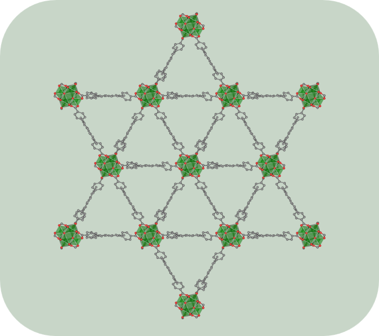
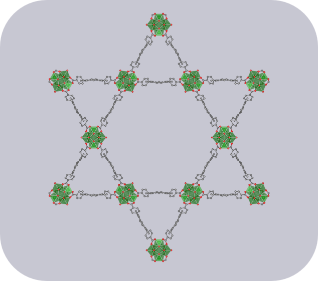
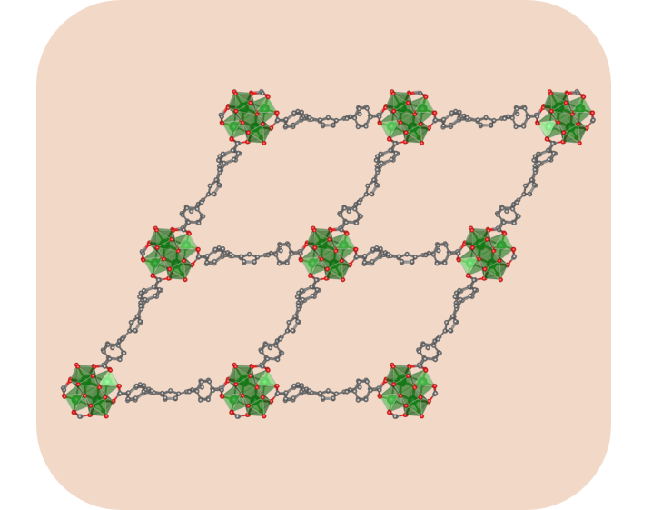
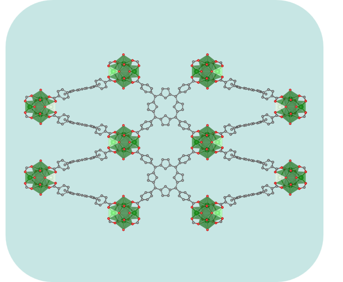

# System preparation

> **Section numbering note.** The methodology is documented across three files. Section numbers are continuous: sections 1--3 appear here; sections 4--5 are in [modeling-and-simulation](../modeling-and-simulation/modeling-and-simulation.md); sections 6--7 are in [energetic-data-analysis](../energetic-data-analysis/energetic-data-analysis.md).

Before any simulation can begin, the structures of both host and guest must be carefully assembled and placed in a physically meaningful state. This section covers that pipeline: selecting and retrieving structures, curating them, and geometry-optimizing all systems at a consistent level of theory to establish a uniform energy reference across the dataset.

Host crystallographic data were retrieved from the Cambridge Crystallographic Data Centre (CCDC), while guest molecule 3D conformers were fetched from the PubChem library. After retrieval, structures were curated with particular attention to the host frameworks, and all systems were subsequently geometry-optimized using the GFN1-xTB extended tight-binding Hamiltonian with D3(BJ) dispersion correction, as implemented in the AMS DFTB engine.

The complete pipeline is documented in the [system-preparation](./../scripts/system-preparation.ipynb) Jupyter notebook.

---

## 1. Structure acquisition

### 1.1. Host structures

A family of porphyrinic Zr-MOFs was selected sharing identical building blocks: the tetrakis(4-carboxyphenyl)porphyrin (TCPP) linker and the $Zr_{6}(\mu_{3}-O)_{4}(\mu_{3}-OH)_{4}$ secondary building unit (SBU). Depending on synthetic conditions, the same components self-assemble into distinct network topologies governed by the connectivity between the 4-connected TCPP linker node and the $Zr_{6}$ SBU. In PCN-223, the $Zr_{6}$ cluster is 12-connected, yielding a [4,12]-connected **shp** net. When the cluster connectivity is reduced to 8, different spatial arrangements of the linkers give rise to the **csq** (MOF-545), **scu** (NU-902), and **sqc** (PCN-225) nets, all [4,8]-connected. PCN-224 (**she**, [4,6]-connected) was considered but excluded due to the prohibitive computational cost of its large unit cell.

<p align="center">
  
  <br>
  <em><b>Figure 2.</b> Different connectivity modes between the 4-connected TCPP linker and the Zr<sub>6</sub>(&mu;<sub>3</sub>-O)<sub>4</sub>(&mu;<sub>3</sub>-OH)<sub>4</sub> SBU giving rise to distinct network topologies: <b>shp</b> (12-connected SBU), <b>csq</b>, <b>scu</b>, and <b>sqc</b> (8-connected SBU).</em>
</p>

This isoreticular series provides a controlled model system: chemical composition is held constant while topology, and with it pore geometry, channel dimensionality, and cavity connectivity, varies systematically.

<table>
  <tr>
    <td align="center">
      
      <br>PCN-223 (<b>shp</b>)
      <br><a href="https://www.ccdc.cam.ac.uk/structures/Search?Ccdcid=1016164&DatabaseToSearch=Published">CCDC: 1016164</a>
    </td>
    <td align="center">
      
      <br>MOF-545 (<b>csq</b>)
      <br><a href="https://www.ccdc.cam.ac.uk/structures/Search?Ccdcid=858640&DatabaseToSearch=Published">CCDC: 858640</a>
    </td>
    <td align="center">
      
      <br>NU-902 (<b>scu</b>)
      <br><a href="https://www.ccdc.cam.ac.uk/structures/Search?Ccdcid=1988217&DatabaseToSearch=Published">CCDC: 1988217</a>
    </td>
    <td align="center">
      
      <br>PCN-225 (<b>sqc</b>)
      <br><a href="https://www.ccdc.cam.ac.uk/structures/Search?Ccdcid=1001018&DatabaseToSearch=Published">CCDC: 1001018</a>
    </td>
  </tr>
</table>
<p align="center"><em><b>Figure 3.</b> Crystal structures of the four selected Zr-MOFs rendered along their principal channel axes. Topology RCSR codes are indicated in parentheses.</em></p>

### 1.2. Guest molecules

All guest structures (`.xyz` files) were retrieved from PubChem using their respective CID keys via the [mof-guest-toolkit](https://github.com/adricu12/mof-guest-toolkit) repository. The full retrieval pipeline is documented in the [system-preparation](./../scripts/system-preparation.ipynb) Jupyter notebook.

Twenty pharmaceutical compounds were selected based on environmental prevalence data from the [German Environment Agency (Umweltbundesamt) database](https://www.umweltbundesamt.de/en/themen/chemikalien/arzneimittel/the-uba-database-pharmaceuticals-in-the-environment). Selection criteria prioritized the most frequently detected compounds, representing the top 50% by detection frequency of 37 substances identified from the database aggregating 2,062 publications across 89 countries.

Seventeen cannabinoid compounds were selected based on research prevalence and structural diversity, encompassing phytocannabinoids, their acidic precursors, and structural analogs differing in side-chain length. This selection was designed to span the chemical space of cannabinoid compounds while including closely related constitutional isomers relevant for selectivity assessment.

The complete list of 37 guest molecules is compiled in [guest_molecules_list.csv](../data/guests.csv):

<!---
<a id="guest-molecules-table"></a>
| Name | Abbreviation | PubChem CID | Type |
|------|-------------|-------------|------|
| Diclofenac | DIC | 3033 | pharma |
| Ibuprofen | IBU | 3672 | pharma |
| Carbamazepine | CAR | 2554 | pharma |
| Sulfamethoxazole | SXT | 5329 | pharma |
| Naproxen | NAP | 156391 | pharma |
| Trimethoprim | TMP | 5578 | pharma |
| Acetaminophen | AC | 1983 | pharma |
| Gemfibrozil | GFB | 3463 | pharma |
| Sulfamethazine | SMZ | 5327 | pharma |
| Bezafibrate | BZA | 39042 | pharma |
| Ciprofloxacin | CPFX | 2764 | pharma |
| Atenolol | AT | 2249 | pharma |
| Estrone | E1 | 5870 | pharma |
| Ketoprofen | KETO | 3825 | pharma |
| Triclosan | TCS | 5564 | pharma |
| 17beta-Estradiol | E2 | 5757 | pharma |
| 17alpha-Ethinylestradiol | EE2 | 57495718 | pharma |
| Sulfadiazine | SSD | 5215 | pharma |
| Clofibric acid | CLF | 2797 | pharma |
| Oxypurinol | OXP | 135398752 | pharma |
| Cannabichromene | CBC | 30219 | canna |
| Cannabichromenic acid | CBCA | 3084339 | canna |
| Cannabidiol | CBD | 644019 | canna |
| Cannabidiolic acid | CBDA | 160570 | canna |
| Cannabidivarin | CBDV | 11601669 | canna |
| Cannabidivarinic acid | CBDVA | 59444387 | canna |
| Cannabigerol | CBG | 5315659 | canna |
| Cannabigerolic acid | CBGA | 6449999 | canna |
| Cannabicyclol | CBL | 59444380 | canna |
| Cannabicyclolic acid | CBLA | 71437560 | canna |
| Cannabinol | CBN | 2543 | canna |
| Cannabinolic acid | CBNA | 3081990 | canna |
| Delta8-Tetrahydrocannabinol | 8d-THC | 638026 | canna |
| Delta9-Tetrahydrocannabinol | d9-THC | 16078 | canna |
| Tetrahydrocannabinolic acid | THCA | 3082459 | canna |
| Tetrahydrocannabivarin | THCV | 93147 | canna |
| Tetrahydrocannabivarinic acid | THCVA | 59444416 | canna |
--->

---

## 2. Structure curation and preparation

As-deposited CIF files from the CCDC were curated by removing lattice and coordinated solvent molecules and by verifying hydrogen atom positions, in particular on the $\mu_{3}$-OH groups of the $Zr_{6}$ SBU. PCN-225 presents a conventional cell that is related to its primitive cell by a body-centering transformation described in the [system-preparation](../scripts/system-preparation.ipynb) Jupyter notebook; the primitive cell was extracted prior to all subsequent calculations, reducing the number of atoms per cell and making the system computationally tractable within the GFN1-xTB framework. Guest molecule 3D conformers retrieved from PubChem were checked for correct protonation state at neutral pH.

Curated host structures:

- [PCN-223](../thesis/011_HOSTS/curated/PCN-223_curated.cif)
- [MOF-545](../thesis/011_HOSTS/curated/MOF-545_curated.cif)
- [NU-902](../thesis/011_HOSTS/curated/NU-902_curated.cif)
- [PCN-225](../thesis/011_HOSTS/curated/PCN-225_curated.cif)
- [Pharmaceuticals and cannabinoids](../thesis/012_GUESTS/curated/)

---

## 3. Geometry optimization

All host and guest structures were subjected to geometry optimization using the GFN1-xTB extended tight-binding Hamiltonian with D3(BJ) dispersion correction, as implemented in the AMS DFTB engine. Host structures were optimized under periodic boundary conditions, relaxing both atomic positions and unit cell parameters simultaneously; guest molecules were optimized as isolated systems in vacuum. Harmonic normal-mode analysis was performed at each optimized geometry to confirm the absence of imaginary frequencies, verifying that each structure corresponds to a local minimum on the GFN1-xTB potential energy surface.

The representative AMS input for host structure optimization is shown below:

<a id="geometry-optimization-run-ams"></a>
```bash
#!/bin/sh

"$AMSBIN/ams" << eor

Task GeometryOptimization
Properties
   NormalModes true
End
System
    Atoms
        X   x y z
    End
    Lattice
        ax ay az
        bx by bz
        cx cy cz
    End
End

Engine DFTB
   Model GFN1-xTB
   DispersionCorrection D3-BJ
EndEngine

eor
```

The `Atoms` block requires Cartesian coordinates; fractional coordinates from CIF files were therefore converted during the generation of inputs. For guest molecules, the `Lattice` block was omitted, as isolated structures are treated without periodic boundary conditions.

After each calculation, the AMS output was processed using the [mof-guest-toolkit](https://github.com/adricu12/mof-guest-toolkit) to extract the optimized geometry (CIF for hosts, XYZ for guests). The full pipeline is documented in the [system-preparation](./../scripts/system-preparation.ipynb) Jupyter notebook.

Optimized host structures:

- [PCN-223](../thesis/011_HOSTS/final_structures/PCN-223_dftb_geo-opt.cif)
- [MOF-545](../thesis/011_HOSTS/final_structures/MOF-545_dftb_geo-opt.cif)
- [NU-902](../thesis/011_HOSTS/final_structures/NU-902_dftb_geo-opt.cif)
- [PCN-225](../thesis/011_HOSTS/final_structures/PCN-225_dftb_geo-opt.cif)
- [Pharmaceuticals and cannabinoids](../thesis/012_GUESTS/final_structures/)


> **Interactive 3D viewer** -- Browse all 37 guest molecules (GFN1-xTB/D3(BJ) optimized geometries):
> [Open molecule viewer](./viewer.html) &nbsp;·&nbsp; [GitHub Pages render](https://htmlpreview.github.io/?https://github.com/adricu12/Tesis-MOFs/blob/main/system-preparation/viewer.html)

Following geometry optimization, a single-point energy (SPE) calculation was performed on every optimized host and guest structure at the same level of theory (GFN1-xTB/D3(BJ)). These energies serve exclusively as the reference terms $E_{\text{host}}$ and $E_{\text{guest}}$ in the binding energy expression defined in [modeling-and-simulation](../modeling-and-simulation/modeling-and-simulation.md); they are stored here and retrieved in the energetic analysis stage.

<a id="single-point-run-ams"></a>
```bash
#!/bin/sh

"$AMSBIN/ams" << eor

Task SinglePoint
System
    Atoms
        X   x y z
    End
    Lattice
        ax ay az
        bx by bz
        cx cy cz
    End
End

Engine DFTB
   Model GFN1-xTB
   DispersionCorrection D3-BJ
EndEngine

eor
```
---
<br>

<div align="right">
  <a href="../modeling-and-simulation/modeling-and-simulation.md"> Go to next: modeling-and-simulation</a>
</div>